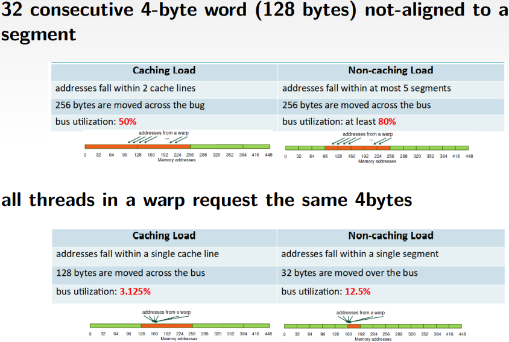

# **GPGPU**

Generalmente il calcolo grafico viene effettuato in maniera vettoriale da delle architetture dedicate, dette GPU.
Sfruttando le architetture per il calcolo grafico, basato su sturrure vettoriali e matriciali, è possibile estendere
l'uso delle GPU alla parallelizzazione di problemi **General Pourpose**. Da qui nascono le **GPGPU**.

Le **GPGPU** eseguono calcoli, dal punto di vista della CPU, con il paradigma **SPMD** (single-processor-multiple-data).

### **GPU**

Nonstante le architetture siano molto potenti, in quanto arrivano fino **a** **1024 thread**, è difficile sfruttare a
pieno la potenza di calcolo in quanto **la logica di funzionamento è differente rispetto ad OMP e MPI**.

Data la sempicità architetturale delle unità elaborative, il **calcolo** che esse devono effettuare deve essere di ****
bassa** difficoltà**.

Altra problematica è costituita da una **limitata località spaziale**, data da cache di piccole dimensioni. Questo
vincolo è presente in quanto vista la massiva presenza di unità di calcolo è necessario, per avere delle **cache
locali**, che esse siano di **dimensioni ridotte**, anche se comunque **complesse e multilivello**.

Per questo motivo si definisce il parallelismo delle GPU come **parallelismo a GRANA FINE**, ovvero ogni unità **
elaborativa** lavora su pochi dati.

Il **bottleneck** delle operazioni è definito nel **passaggio dei dati nella memoria della GPU**.

### **Confronto tra CPU e GPU**

- #### **CPU**

Le cpu hanno una **logica di cotrollo complessa**, ad esempio interruzioni o jumps.

Presentano **pochi core**.

Presentano delle **cache multilivello** di grandi dimensioni.

La **velocità di clock è elevata**.

Le pipes sono caratterizzate da **pochi stadi** dati dalla presenza nelle istruzioni di interruzioni o di cicli.

- #### **GPU**

Le GPU presentano unità di **elaborazione multiple**, molto più **semplici** delle CPU e più simili a delle **ALU**.

Sono ottimizzate per il **calcolo grafico** e con molti **più stadi di pipes,** possibili grazie alla **assenza di
interruzioni** all'interno delle istruzioni elaborate.

Il **throughput è molto alto** poichè le elaborazioni sono effettuate da **migliaia di unità elaborative** in parallelo.

La **logica di controllo** impiegata è molto **semplice**, anche se la sua complessità sta crescendo e avvicinandosi a
quella delle CPU.

## **Architettura delle GPU CUDA**

La CPU, al momento della esecuzione di un task in parallelo sulla GPU, esegue un **kernel**, ovvero una **unica
funzione** comune ad ogni unità elaborativa della GPU. Quando la GPU esegue il kernel, **non può interrompere la
computazione** finchè essa non termina.

In questo paragrafo si descrive la struttura della architettura di GPU Cuda.


La architettura Cuda viene sostanzialmente a comporsi di tre livelli.

- **Griglie**: sono la prima suddivisione della architettura. Esse contengono delle sottostrutture interne e possono
  essere articolate in 1D, 2D e 3D.

- **Blocchi**: i blocchi sono contenuti all'interno delle griglie e contengono a loro volta delle sottosezioni
  contenenti effettivamenete i blocchi di elaborazione della GPU. Anche essi sono articolati in 1D, 2D o 3D.

- **Thread**: Propri di ogni blocco, i threada sono delle piccole **unità di calcolo**. Essi, come i casi precedenti,
  possono articolarsi in architetture a 1D, 2D o 3D. Ogni thread, per il proprio corretto funzionamento ha al suo
  interno una memoria dedicata, di solito privata.

### Memorie presenti nella griglia

All'interno di ogni griglia sono presenti tre diverse tipologie di memoria condivisa dai blocchi nella griglia.

- **Memoria globale**;

- **Memoria costante**;

- **Memoria texture**: impiegata per calcoli grafici particolari come la rifrazione della luce su un oggetto.

### Memorie presenti nei blocchi

In ogni blocco è presente una **memoria shared** condivisa tra i thred in esso presenti.

Questa ha una larghezza di banda molto elevata, permettendo così di **poter implementare una comunicazione tra thread
solo se presenti all'interno dello stesso blocco**.

### Memorie all'interno dei thread

All'interno di ogni thread sono presenti sia una **memoria locale,** che funge da cache per l'unità di elaborazione, sia
dei **registri**, che devono seguire distribuzione spaziale dei thread.

# **CUDA**

CUDA è una **API** di programmazione per schede video NVIDIA. I linguaggi impiegati per l'interazione C e Fortran.

### **API**

Le api di CUDA sono suddivise principalmente in **due livelli** mutuamente esclusivi nell'impiego:

- **Driver API**: riguardanti l'interazione di basso livello;

- **Runtime API**: comandi per gestione delle componenti della gpu;

Il livello **runtime parla con il livello driver**. Questo perchè le ottimizzazioni effettuate devono avere un riscontro
hardware, ottenuto mediante l'impiego dei driver.

## Warps

Sono un **raggruppamento di thread** all'interno degli SM, generalmente di 32 threads.

In particolare i thread, i quali effettuano la stessa **istruzione nello stesso tempo**, sono scelti dal driver per
essere raggruppati in Warp (array di ALU).

Idealmente, sarebbe inoltre necessario, che le istruzioni seguenti per ogni thread nel warp siano uguali tra loro. Se
così accade le prestazioni sono MOLTO incrementate.

Inoltre, per permettere il passaggio di dati nei warp parallelamente all'esecuzione delle istruzioni negli stessi, sono
predisposti dei **moduli speciali LDST** (load and store) i quali effettuano una fase di pre-fetching per inserire i
dati nelle cache locali.****
****

## **Compute capability**

La compute capabilty costituisce la **misura della capacità di calcolo** di un dispositivo definita come:

una **coppia X.y** dove:

- **X** è il major number che identifica l'**architettura del chipset**.

- **y** è il minor number e rappresenta la **differenza di release** dello stesso chipset.

E' importante notare che l'efficienza **non dipende dall' aumento della compute capability**.

All'interno della tabella identificativa delle GPU è possibile andare a vedere i **parametri di analisi** delle
prestazioni andando a visionare i campi:

- **Streaming Multiprocessor**:parametro che indica il numero di **raggruppamenti di thread a livello del blocco**.
  Questo parametro identifica in quante unità suddividere il carico per ogni blocco;

- **Thread / Warp**: rappresenta il numero totale di thread per ogni warp;
- **MaxWarps / SM**: numero massimo di warp per ogni SM;
- **Max Thread / SM**: numero massimo di thread per ogni SM;
- **Max ThreadBlock / SM**: numero massimo di blocchi di thread per ogni SM;

****

## **Threads and streming multiprocessor**


<br>

Ogni **thread è eseguito da un Core**. Blocchi di thread snno eseguiti da blocchi di core organizzati in **streaming
multiprocessor**. La loro esecuzione è schedulata secondo il **Round-Robin** ed è **indipendente** tra i vari blocchi.

I blocchi di thread sono organizzati in **griglie**. La loro esecuzione è tanto più parallela quanto più sono gli
streaming multiprocessor.


****

## **Gestione dei dati**

I movimenti dei dati possono essere effettuati **o dalla CPU ,definita anche host, alla GPU, definita anche device,(H2D)
o viceversa (D2H)**.

Questa fase costituisce il bottleneck della esecuzione parallela su GPGPU. I movimenti vengono effettuati **o prima o
dopo la computazione** in quanto l'esecuzione del kernel non può essere interrotta.

I movimenti dei dati sono gestiti dal protocollo **PCIe e DDR**.

In alcune architetture di NVIDIA il protocollo impiegato per la comunicazione dei dati è basato su una infrastruttura
proprietaria, **NVLink più costosa ma con prestazioni altissime**.

****

## **Latenze**

La fase di prefetching o riordino delle istruzioni all'interno delle GPGPU è stata inserita per permettere un continuo
funzionamento delle unità di calcolo.

Questo poichè la latenza massima per l'esecuzione di una istruzione, anche critica, è circa 30 cicli di clock, mentre
una operazione di load and store può avere una latenza fino a 800 cicli di clock.

Questa asimmetria, se non gestita, causerebbe delle interruzioni di funzionamento delle unità di calcolo.

La soluzione può avvenire tramite due strade, anche combinate:

- **Thread-Level Parallelism**


<br>
Schedula tanti thread quanti è possibile trovare all'interno del warp.
I thread vengono eseguiti appena essi sono pronti, in maniera indipendente tra loro.

- **Instruction-level Parallelism**
  Un modo con granularità ancora più fine in quanto i thread vengono raggruppati analizzando le isatruzioni da eseguire.

****

# Estensione della sintassi per CUDA

Il **kernel** si definisce in C con la **keyword \_\_global\_\_** prima di definire una funzione.

Il kernel viene eseguito N volte da N diversi Thread CUDA sulla GPU. Ogni thread ha un **un id univoco**, consultabile
con la variabile **threadIdx** .

Ogni variabile dichiarata come dim3 realizza una struttura dati i cui campi sono consultabili con .x, .y , .z . A
seconda del numero dei parametri passati al costruttore, si dichiara una matrice, un vettore o un parallelogramma.

Per dichiarare il numero di thread che eseguono il kernel si usa una specifica affiancata al nome del kernel da
eseguire.

```c
kernelFunction<<<numBlocks,numTreads>>>(args...)
```

In questo caso possiamo evidenziare **due paramentri**:

- **numBlocks** (o gridDim): rappresenta la **taglia della griglia** in termini di **blocchi di thread**, lungo ogni
  dimensione, si dichiara con **dim3**.
- **numThreads** (o blockDim): la **taglia dei blocchi** rappresentata in thread per o**gni dimensione**, si rappresenta
  con **dim3**

*Esempio:*

```c
  dim3 numThreads(32);
  //il numero di blocchi è dichiarato comunque dim3 e possiamo definire fino a 3 dimensioni, ogni dimensione è data dalla grandezza della struttura dati da manipolare in quella dimensione, rapportata ai thread disponibili.
  dim3 numBlocks((N-1)/numThreads.x+1);
  kernelFunction<<<numBlocks,numThreads>>>(args...);

```

***

## Metodologie di calcololo dell' offset

A seconda della topologia scelta per la nostra griglia e per i suoi blocchi all'interno, il calcolo dell' indice,
rappresentativo per ogni thread, cambia.

### **Griglia di 1D e Blocchi di 1D**


<br>
In questo caso è necessario calcolare l'offest per ogni singolo thread analizzando soltanto la dimensione su x.

```c
  int index = blockIdx.x * blockDim.x + threadIdx.x;
```

Il **primo pezzo** della assegnazione rappresenta **quanti blocchi saltare**, in termini di thread;

Il **secondo pezzo** invece, dato il *b-esimo blocco*, ci dice **quale thread stiamo considerando** di quest' ultimo;

### **Griglia di 1D e Blocchi di 3D**


<br>
In questo caso è necessario calcolare l'offset andando a considerare le tre dimensioni del blocco.

```c
  int index = blockIdx.x * blockDim.x * blockDim.y * blockDim.z +
              threadIdx.z * blockDim.y * blockDim.x + 
              threadIdx.y * blockDim.x +
              threadIdx.x;
```

Il **primo termine** rappresenta il numero di **blocchi da saltare** per arrivare al blocco interessato (rappresentato
da blockIdx.x);

Il **secondo** rappresenta il **numero di layer** di thread nel blocco interessato che sono allineati sulla stessa z e
che sono **da saltare**;

Il **terzo termine** rappresenta, dato il layer selezionato,**le righe da saltare** per accedere alla riga corretta;

Il **quarto termine** rappresenta l'**id del thread** nella riga;

### **Griglia d 2D e Blocchi di 2D**

In questo caso il calcolo dell'offset si esplica nella valutazione dell'offset sia nella dimensione x e y della griglia.


<br>

Questa metodologia viene generalmente applicata quando si desidera **mappare in memoria una matrice**.

1. Nel caso in cui una matrice abbia **dimensione tale da non poter essere mappata** completamente nella griglia allora
   è **necessario suddividerla** in sottomatrici;

2. Nel caso in cui la matrice sia completamente **mappata ed esattamente pari alla griglia**;

3. Altresì è possibile che la matrice sia mappabile all'interno della griglia ma abbia **taglia ridotta** rispetto ad
   essa. Quindi sono presenti aree della griglia che non hanno **mappate al di sopra degli elementi della matrice**.

Il primo caso generalmente è riconducibile, tramite la decomposizione in sottomatrici, nei due successivi.

In generale gli offset fanno riferiento alla dimensione della griglia e dei blocchi e non a quella della matrice da
mappare e sono calcolabili come segue:

```c
  int i = blockIdx.x * blockDim.x + threadIdx.x;

  int j = blockIdx.y * blockDim.y + thredaIdx.y;
```

Il primo elemento di entrambe le formule viene impiegato per calcolare il numero di blocchi, espresso in thread, da
saltare.

I secondi termini rappresentano i thread negli specifici blocchi.

```c
//rappresentazione dell'indice dopo aver mappato la matrice in memoria attraverso una notazione linearizzata.
  int index = j * MatrixWidth + i;

  //nel caso in cui si vogliano mappare i dati della matrice con l'intero insieme di blocchi, allora:

  MatrixWidth =  gridDim.x * blockDim.x;
```

*Esempio*:

Kernel del prodotto tra due matrici N*N, ogni thread esegue l'operazione su un singolo elemento delle stesse.

```c 
    __global__ void matrixAdd(int N, const float ∗A, const float ∗B, float ∗C) {
      int i = blockIdx.x ∗ blockDim.x + threadIdx.x;
      int j = blockIdx.y ∗ blockDim.y + threadIdx.y;

      int index = j ∗ N + i;

      if ( i < N && j < N )
        C[index] = A[index] + B[index];
    }
```

Il calcolo di **i e j** si effettua per ottenere la **misura degli offset** rispetto alla griglia in cui è mappata.

Il calcolo dell'index effettuato per avere il **riferimento all'indice della matrice** e viene anche in questo caso
effettuato in maniera linearizzata.

L'**if** all'interno della funzione viene **impiegato per verificare se l'accesso ai dati rientra nell'area di mappatura
della matrice o si sta andando oltre**. Se si sta andando oltre si potrebbe accedere a blocchi impiegati in altro modo,
non inerenti alle matrici.

L'inserimento dell'**if è molto dispensioso** a livello di compilazione (tradotto in una jump e poichè ci sono pipe che
hanno cattive prestazioni con istruzioni di salto, le prestazioni calano e la pipe lunga non viene sfruttata) e quindi
un **modo alternativo per aumentare le prestazioni mantenendo la correttezza è comunque operare sull'intero blocco**,
nonstante la matrice non sia mappata sull'intero blocco.

**Alcuni thread** in parallelo, semplicemente, effettueranno delle **operazioni non rilevanti**.

***

# Gestione della memoria in CUDA

Per poter gestire i dati all'interno della GPGPU è necessario allocare della memoria sul device e poi inizializzarla ai
dati che desideriamo gestire.

All'interno di CUDA tutte le funzioni hanno come parametro di ritorno **un codice di errore** che può essere anche **
cudaSuccess**.

## **cudaMalloc**

Per gestire l'allocazione della memoria sulla GPU si utilizza la funzione:

```c
    cudaError_t cudaMalloc ( void** devPtr, size_t size )
```

```c 
  double *array_device;
  cudaMalloc((void**) &array_dev, N * sizeof(double));
```

In questo esempio viene allocato un riferimento alla area di memoria che si desidera allocare sulla GPGPU anche se è
memorizzato sull'host.

E' da notare come, essendo in C il passaggio dei parametri unicamente per copia ,si necessita passare l'indirizzo di
memoria della variabile su cui si vuole scrivere il valore di ritorno (puntatore), questo poichè la cudaMalloc, come
detto precendentemente, ritorna il codice di errore.

Essendo che il valore di ritorno rappresenta un puntatore ad una area di memoria si necessita passare un doppo
puntatore.

Si nota come, inoltre, la cudaMalloc abbia bisogno di un void** in quanto la memoria allocata è di tipo generico,
pertanto si necessita un casting per la compatibilità del tipo.

Per poter deallocare la memoria viene adoperata la funzione **cudaFree** nella quale va specificato il puntatore
all'area di memoria da dover deallocare.

## **cudaMemset**

Funzione impiegata per poter inizializzare le aree di memoria allocate sul device.

```c
    cudaError_t cudaMemset (void * devPtr, int value, size_t count )
```

Il funzionamento è di tipo ottimizzato in quanto sfrutta il DMA della architettura facendo sniffig del bus e facendo al
momento opportuno bus stealing.

Per questa funzione la memoria puntata dal primo argmento alvalore specificato nel secondo parametro.

## **cudaMemcpy**

Per permettere la inizializzazione della memoria allocata in modo bidirezionale.

```c
cudaError_t cudaMemcpy(void* dst, const void* src, size_t count, cudaMemcpyKind kind)
```

Vengono grazie a questa direttiva copiati i dati specificati in tre direzioni:

- **H2D**: ovvero dall'host alla GPU. Questa direzione si specifica con la keyword *cudaMemcpyHostToDevice*;

- **D2H**: ovvero dalla GPU alla CPU. Questa direzione si specifica con la keyword *cudaMemcpyDeviceToHost*;

- **cudaMemcpyDeviceToDevice**: ovvero la copia dei dati dalla GPU alla GPU;

*Esempio*:

```c
    cudaMemcpy(array_dev,array_host, sizeof(array_host,cudaMemcpyDeviceToHost)
    cudaMemcpy(array_host,array_dev, sizeof(array_dev,cudaMemcpyHostToDevice)
```

La direzione della copia viene però a mancare nel caso in cui utilizziamo Cuda 4.0 o maggiori in quanto essa riesce a
comprendere in modo automatico la direzione della copia.

## **Esempio completo delle funzioni**

```c
  #include <stdio.h>
#include <stdlib.h>

void  initVector(double *u, int n, double c) {
  int i;
  for (i=0; i<n; i++)
      u[i] = c;
}

__global__ void gpuVectAdd(double *u, double *v, double *z, int N) 
{
  // define index
  int i = blockIdx.x * blockDim.x + threadIdx.x;

  // check that the thread is not out of the vector boundary
  if (i >= N ) return;

  int index = i; 
  // write the operation for the sum of vectors 
  z[index] = u[index] + v[index];
}


int main(int argc, char *argv[]) {

  // size of vectors
  const int N = 1000;

  // allocate memory on host
  double * u = (double *) malloc(N * sizeof(double));
  double * v = (double *) malloc(N * sizeof(double));
  double * z = (double *) malloc(N * sizeof(double));

  initVector((double *) u, N, 1.0);
  initVector((double *) v, N, 2.0);
  initVector((double *) z, N, 0.0);

  // allocate memory on device
  double *u_dev, *v_dev, *z_dev;
  cudaMalloc((void **) &u_dev, N*sizeof(double));
  cudaMalloc((void **) &v_dev, N*sizeof(double));
  cudaMalloc((void **) &z_dev, N*sizeof(double));

  // copy data from host to device
  cudaMemcpy(u_dev, u, N*sizeof(double), cudaMemcpyHostToDevice);
  cudaMemcpy(v_dev, v, N*sizeof(double), cudaMemcpyHostToDevice);

  dim3 block(32);
  dim3 grid((N-1)/block.x + 1);

  // define the execution configuration
  gpuVectAdd<<<grid, block>>>(u_dev, v_dev, z_dev, N);

  // copy data from device to host
  cudaMemcpy(z, z_dev, N*sizeof(double), cudaMemcpyDeviceToHost);

  for(int i=0;i<N;i++)
  	printf("z\[%d\] = %f\n",i,z[i]);

  // free resources on device
  cudaFree(u_dev);
  cudaFree(v_dev);
  cudaFree(z_dev);

  // free resources on host
  free(u);
  free(v);
  free(z);

  return 0;
}s
```

## **Compilatore in CUDA**

Il compilatore per il processing dei file CUDA lavora attraverso una divisione in due fasi: una fase di **frontend** ed
una fase di **backend**.

Nella fase di forntend si occupa della della definizione di codice oggetto **sia per la GPU che per la CPU**. Inoltre il
ompilatore genera del codice Qbin e non lo genera per architetture predefinite, ma per diverse architetture. Deve essere
quindi **specificata l'architettura per la quale deve essere prodotto il codice**.

```c
nvcc --arch = compute_37 --code = sm_37 (caso con K80)
```

nella quale si specificano sia la compute capability che lo streming multiprocessor della architettura in questo momento
impiegata.

## **Error handling**

Tutte le system call Nvidia definiscono una variabile cudaError_t come valore di ritorno che permette di verificare lo
stato della eseuzione della direttiva.

Il valore della cudaError_t è rappresentato attraverso un intero al quale ci si può riferire nel caso di successo
attraverso la define cudaSuccess.

Per la gestione degli errori nel caso in cui essi avvengano nella esecuzione del Kernel, il quale ha un funzionamento
bloccante, è necessario andare a leggere una variabile che mantenga al suo interno il valore dell'ultimo errore
rintracciato:

```c
    cudaGetLastError();
```

la funzione deve essere chiamata a seguito di una sincronizzazione esplicita con il termine della esecuzione del kernel.
Ciò può essere implementato attraverso la specifica:

```c
    cudaDeviceSynchronize();
```

Alternativamente è possibile adoperare la macro:

```c
    #define CUDA_CHECK(X) {\
      cudaError_t _m_cudaStat = X;\
      if(cudaSuccess != _m_cudaStat) {\
        fprintf(stderr,"\nCUDA_ERROR: %s in file %s line %d\n",\
        cudaGetErrorString(_m_cudaStat), __FILE__, __LINE__);\
        exit(1);\
      } \
    }

    ...
    
    CUDA_CHECK( cudaMemcpy(d_buf, h_buf, buffSize, cudaMemcpyHostToDevice));
```

***

## **CUDA Events**

Un evento è una particolare variabile impiegata all'interno del codice per marcarlo. Esso ha due finalità:

- ottenere il tempo di una esecuzione;
- identificare punti di sincronizzazione della CPU e della GPU;

### **Ottenimento del tempo**

Vengono definite all'interno del programma dei punti di acquisizione di dati istanti temporali.

Si crea un evento di tipo start e stop per l'acquisizione degli istanti temporali. All'inizio del codice da monitorare
si effettua un EvenRecord di start e al termine si effettua un EventRecord di stop.

Se si vuole effettivamente assicurare che il tempo preso sia quello del Kernel si deve effettuare una chiamata
sincronizzata in modo da non registrare l'evento prima della sua fine.

Per il calcolo della differenxa si chiama la funzione cudaEventElapsedTime nella quale si salva la differenza
all'interno della variabile specificata come prima variabile.

*Esempio:*

```c
  cudaEvent t start, stop;
  cudaEventCreate(&start);
  cudaEventCreate(&stop);
  cudaEventRecord(start);
  ...
  kernel<<<grid, block>>>(...);
  ...
  cudaEventRecord(stop);
  cudaEventSynchronize(stop);
  float elapsed;
  // execution time between events in ms
  cudaEventElapsedTime(&elapsed, start, stop);
  cudaEventDestroy(start);
  cudaEventDestroy(stop);
  ```

## **Prestazioni di una programma in Cuda**

### Bandwidth di un programma in Cuda

All'interno di una applicazione Cuda è importante valutare la memory bandwidth.

La situazione ideale sarebbe quella di effettuare un unico trasferimento per l'intera mole di dati dalla CPU alla GPU.

Spesso ciò non è possibile quindi è necessario ottimizzare i trasferimenti ed evitare dei tempi di idle della CPU e
della GPU.

Per la valutazione della bandwidth del bus allora si effettua un comando che permette di valutare la prestazione del bus
dei trasferimenti specificando:

- **il valore di start delle misurazioni**

- **il valore di stop delle misurazioni**

- **l'offset delle misurazioni**

```c 
./bandwidthTest --mode=range --start=<B> --end=<B> --increment=<B>
```

La misurazione viene effettuata in **MFlop** ovvero il numero di floating point operations per second.

## Ottimizzazione delle prestazioni

Attraverso la scelta dei parametri di configurazione del kernel:

- **gridSize** : numero di blocchi nella griglia;
- **blockSize** : numero di thread nel blocco;

è possibile prestazioni diverse sulla stessa struttura hardware a seconda dei loro valori.

Per decidere questi valori è necessario:

- rispettare i limiti di thread per blocco, imposti dalla GPU;

- selezionare la configuarzione della griglia in modo che possa processare tutti gli elementi;

- selezionare la taglia dei blocchi per evitare deadlock tra thread e minimizzare la dipendenza tra i kernel eseguiti
  nei vari thread.

- impiegarei qualificatori propri di CUDA per riferirsi agli id dei blocchi (threadIdx, blockIdx);

### Come effettuare una corretta ottimizzazione

Deve essere ispezionata la scheda tecnica dei CUDA per la GPU effettivamente impiegata. Sono di interesse le grandezze
di SM disponibili e il numero di core per ognuno di essi.

Oltre al dimensionamento dei core per SM da effettaure deve essere anche effettuata una corretta distribuzione dei
registri ad essi. Chiaramente deve essere rispettata la necessità di un numero minimo di registri per ogni kernel o
altrimenti verrà rallentata la velocità di esecuzione a causa dei tempi di attesa.

### **Esempio di risoluzione di una configurazione**

``` 
32768 registri per SM; Kernel con una griglia 32x8 blocchi di thread; il kernel necessita di 30 registri. (il kernel viene eseguito da ogi thread)

Quanti blocchi di thread possono essere ospitati su un solo SM?
```

1. calcolo di registri totali necessari:

``` 
numero di registri totali per blocco= 
 numero di thread per blocco * numero di registri per thread 
```

risultato : 32\*8\*30 =7680

2. calcolo dei possibili blocchi che lo streaming multiprocessor può ospitare.

```c 
numero di blocchi allocabili =
parte intera di (numero di registri disponibili per SM / numero di registri per blocco)
```

risultato: 32768 / 7680 = 4

Nel caso in cui il numer di registri varia, varia altresì il numero di blocchi allocabili.

In generale la taglia appropriata di blocchi per una data architettura viene calcolaata attraverso la **TILE_WIDTH**
ovvero un dimensionamento 2^x * 2^x thread per blocco.

Alla variazione dei valori di x della tile_width viene calcolata l'effettiva occupazione dei thread disponibili sulla
scheda video considerata tramite la compute capability (si deve rispettare il numero massimo di blocchi per ogni SM).

Si **sceglie la configurazione con la migliore occupazione dei thread disponibili su streaming multiprocessor**.

### Secondo esempio di risoluzione con uso di TILE WIDTH

```
Ipotesi: architettura fermi in cui ogni SM può gestire 1536 threads e al massimo 8 blocchi residenti

Bisogna effettuare delle prove con diversi TILE WIDTH e scegliere il piu conveniente 
```

- Scelgo una TILE WIDTH iniziale di **8**  
  <br>
  8 \* 8 = 64 threads per blocco. La scheda fermi ne mette a disposizione 1536, quindi possono essere allocati
  totalmente 1536 / 64 =24 blocchi. Essendo il **massimo numero di blocchi 8**, possono essere impiegati solamente 8 dei
  24 blocchi. Il numero dei thread effettivamente allocati per ogni SM sarà quindi **64 \* 8 = 512** thread.
  
  <br>

  Avremo quindi una occupazione del 33%.

  <br>

- L'occupazione non è quindi ottimizzata, scegliamo una TILE WIDTH **16**

  <br>
  16 \* 16 = 256 threads per blocco. La scheda fermi ne mette a disposizione 1536, quindi possono essere allocati
  totalmente 1536 / 256 = 6 blocchi.

  Essendo il **massimo numero di blocchi 8**, possono essere impiegati completamente i 6 blocchi a disposizione.
  Il numero dei thread effettivamente allocati sarà la totalità di quelli a disposizione.

  <br>

  Avremo quindi una occupazione del 100%.

  <br>

- Scegliendo come valore della TILE WIDTH **32** avremo una occupazione del 66%.

Pertanto nel determinare la TILE WIDTH corretta va considerato il parametro di occupazione delle risorse per effettuare la scelta migliore.

## **Errori e performance** 

E' possibile aggiungere la gestione degli errori in CUDA attraverso l'impiego di alcune direttive.

Per la cattura degli errori viene invocata la funzione la quale permette di avere un ascoltatore di eventuali errori che possono avvenire durante l'esecuzione del kernel.

```c 
  cudaError_t cudaGetLastError ( void )
```

```c
  //inizializza una variabile contenitore di eventuali errori
  mycudaerror=cudaGetLastError() ;

  <Call KERNEL>
  //sincronizzazione tra host e device 
  cudaDeviceSynchronize() ;

  mycudaerror=cudaGetLastError() ;
  //se si sono riscontrati errori durante l'esecuzione del kernel in questo punto vengono gestiti
  if(mycudaerror != cudaSuccess)
    fprintf(stderr,”%s\n”, cudaGetErrorString(mycudaerror)) ;
```
<br>

# **Gerarchia di memorie in CUDA**
All' interno della **architettura** di una **GPU** è possibile notare come sono presenti **diverse** tipologie di **memoria**, le quali si **differenziano** per tipo di **visibilità** e per **velocità** di **operazioni** input-output.

Quindi a seconda della località dei dati imposta dall' algoritmo che si sta implementando, potrebbe essere, ad esempio, più efficiente, effettuare un caching sulla **Shared Memory**, rispetto che interrogare la **Global Memory**.

In generale esistono cinque tipi di memorie totali.
- **Due** di queste, sono risorse **assegnate** ai **singoli blocchi** e sono:
  - **Registri**
  - **Shared** Memory
- Altre **tre** invece sono disponibili, sulla intera GPU e sono persistenti per tutta la durate del kernel  e sono:
  - **Global** Memory
  - **Constant** Memory
  - **Texture** Memory

***
## **Registri**
Allocati per ogni streaming multiprocessor, in realtà in ogni SM ha vari core e nel momento della inizializzazione del kernel vado ad allocare dei registri per ogni core, come abbiamo visto precendentemente.

Vediamo come è anche possibile andare a **limitare** il **numero** di **blocchi** da poter **allocare** o il **numero** di **registri** per ogni thread, aggiungendo delle **direttive** a tempo di compilazione.
```c
__global__ void __launch_bounds__(maxThreadsPerBlock, minBlocksPerMultiprocessor)
```

***
## **Global Memory**
La **memoria** **più grande** disponibile sulla **GPU**, rappresentae lo stesso concetto della RAM per la CPU, l' **esecuzione** del **kernel** **non resetta** la **memoria**, quindi è possibile trovare risultati di kernel precedenti su esecuzioni future.

Inoltre è possibile utilizzare sia in **scrittura** che in **lettura** per **tutti i thread**.

- Il **vantaggio** principale viene rappresentato da una **grande larghezza di banda**, che può arrivare fino ad un **1 TB/s**.
  
- Lo **svantaggio** invece, viene rappresentato dalla **latenza**, sebbene è possibile trasferire una grande quantita di dati in parallelo, **ogni accesso** alla memoria **costa** dai **400** agli **800**, **cicli di clock**. Mentre sappiamo che una normale operazione, come una addizione, costa soltanto un ciclo di clock.


La global memory può essere **allocata** in **due** **modi** differenti, o in maniera **dinamica**, mediante la cudaMalloc, oppure come una variabile globale in **area statica**.
```c
  //allocazione della variabile globale in area statica
  __device__ type variable_name;

  //allocazione della variable globale in maniera dinamica
  type *pointer_to_variable;
  cudaMalloc((void**) &pointer_to_variable, size);
  ...
  cudaFree(pointer_to_variable)
```
### **Cache** per **Global Memory**
Vediamo come per ogni **blocco** sono disponibili **due cache**, una di **L1** ed una seconda di **L2**. In particolare la **cache di L2** è **associata** allo **Streaming Multiprocessor** e non al blocco.

In realtà quindi più blocchi hanno privatamente una cache di L1 e invece condividono una cache di L2.

Con la **L2** la **latenza** **migliora** rispetto alla Global Memory, anche se non è velocissima, infatti ha soltanto il **25%** di latenza **in meno** **rispetto** alla **Global Memory**. Intorno ai 20/50 cicli di clock.

Le operazioni per la gobal memory **passano tutte totalmente per la cache**, essa infatti ricopre il ruolo di un buffer.

### **Cache configurabili**

Per alcune architetture è possibile avere una configurazione manuale delle cache di L1 e delle shared memory.

In generale solitamente si ha una taglia massima da poter bipartire dividendo la memoria totale tra L1 e Shared Memory.

Ad esempio in una architettura Fermi  la taglia massima da poter bipartire è costituita da 64 KB.

Sarebbe possibile in primis suddividerla in modo equo, ma anche con suddivisioni asimmetriche.

```c
  cudaFuncSetCacheConfig(kernel1, cudaFuncCachePreferL1); // 48KB L1 / 16KB ShMem
```
In questo caso la suddivisione avviene allocando 48 KB per la L1 e 16 per la Shared Memory "preferendo" la L1.

```c
  cudaFuncSetCacheConfig(kernel2, cudaFuncCachePreferShared); // 48KB ShMem / 16KB L1
```
In questo caso la suddivisione avviene allocando 48 KB per la Shared Memory e 16 per la L1 "preferendo" la prima.

E' inoltre possibile avere una disabilitazione della cache L1 attraverso la direttiva ***Xptras -djcm = cg***.

E' impossibile invece disabilitare la cache L2 a causa del ruolo centrale da essa ricoperto.


### **Lettura dei dati in memoria**

E' possibile accedere in lettura alla memoria in modo differenziato a seconda dell disposizione dei dati in essa.

Al variare dell'accesso, inoltre, avviene una variazione anche nella bandwidth ottenuta.

1. Accesso ad **Offset**:  si accede alla memoria attraverso indicizzazione e gli elementi sono adiacenti in memoria;

```c
  __global__ void offsetCopy(float ∗odata, float∗ idata, int offset) {
    int xid = blockIdx.x ∗ blockDim.x + threadIdx.x + offset;
    odata[xid] = idata[xid];
  }
```

2. Accesso a **Stride**: necessario, per accedere alle locazioni interessate, saltare degli elementi (stride);

```c
  __global__ void strideCopy (float ∗odata, float∗ idata, int stride) {
    int xid = (blockIdx.x∗blockDim.x + threadIdx.x) ∗ stride;
    odata[xid] = idata[xid];
  }
```

### **Ottimizzazione degli accessi alla memoria globale**

Gli accessi alla memoria globale generalmente avvengono ad opera di warp, ovvero raggruppamenti di istruzioni dello stesso tipo. Questa modalità di accesso permette di aumentare la probabilità che gli acessi avvengano allo stesso indirizzo o ad aree di memoria contigue.

<br/>


<br/>

Sono possibili diverse configurazioni di accesso in memoria da parte dei thread presenti nel warp.

Nel primo caso i thread accedono in maniera perfettamente corrispondente ai dati allocati in memoria sulla cache L1 senza effettuare delle sovrapposizioni. Il bandwidth assicurato è del 100% sia con uso di cache che senza.

Nel secondo caso l'accesso è ugualmente con utilizzo del 100% del bus, ma i dati sono acceduti permutandoli.


<br/>


<br/>

In questi casi, invece si ha una perdita nell'impiego effettivo del bus dei trasferimenti.

Nel primo caso se i dati sono allocati non su una unica linea di cache, ma ipotizziamo su due. Di conseguenza i dati saranno caricati tutti e poi saranno prelevati unicamente quelli utili. L'impiego del bus sarà al 50% con uso di cache. 

Questo aumenta nel caso di eliminazione della cache in quanto saranno caricati unicamente i "pezzi" di memoria necessari. Nel caso in cui ne caricazzimo 5 l'impiego sarebbe dell' 80%.

Nel secondo caso, invece, si ha una collisione degli accessi in una unica locazione si memoria. 
Con l'impiego della cache la totalità della linea di cache sarà caricata a fronte dell'uso di una unica locazione con impiego del bus del 3,125%.

L'impiego cresce al 12,5% nel caso in cui viene eliminata la cache e si effettua il caricamento di una sola locazione che contiene l'informazione desiderata.

### **Ottimizzazione letture stride**
Con il meccanismo delle cache multiple si potrebbe **ottimizzare** l' **accesso** per **stride** facendo diventare addirittura **migliore** rispetto all' accesso per **offset**.
C'è però bisogno che **la memoria e i warp** vengano **configurati** in maniera opportuna essendo gli accessi pensati per una configurazione **in 2D**.

Per face ciò CUDA fornisce un **metodo di allocazione** della memoria **alternativo** denominato *cudaMallocPitch*. Questa funzione ritorna un intero detto **pitch** che tiene conto delle **dimensioni** reali della memoria in **2D**, così da poter **effettuare** i **salti** mediante lo stride.

```c
  // on host
 int width = 64, heigth = 64;
 float ∗devPtr;
 int pitch;
 cudaMallocPitch(&devPtr, &pitch, width ∗ sizeof(float), height);

 // on device
 __global__ myKernel(float ∗devPtr, int pitch, int width, int height){
    for (int r = 0; r < height; r++) {
        /*vediamo come bisogna tener conto della dimensione di riga mediante ilpith
         quest' ultimo infatti deve essere utilizzato per poter saltare correttamente 
        tra più righe */
        float ∗row = devPtr + r ∗ pitch; // row = devPtr[r*pitch]
        
        for (int c = 0; c < width; c++)
            float element = row[c];  // element = devPtr[r*pitch][c]
    }
 ...
 }
```


***
## **Shared Memory**
La Shared memory viene **condivisa** soltanto all' **interno del blocco**, risulta essere  piccola rispetto alla global memory, infatti in alcune architetture può dividere la sua grandezza con la cache di L1, come detto in precedenza.

Inoltre a differenza della global memory, alla **fine** della esecuzione del **kernel**, le **shared memory vengono resettate**.
- Il **punto** di **forza** principale di queste **memorie** è la presenza di una latenza molto bassa, infatti le shared memory, per operazione in input-output, hanno una **latenza** di **2 cicli di clock**, con un **throughput** di 32 byte/2 cicli di clock.

- Bisonga però tener conto della possibilità di **race condition** nel caso in cui più **thread** nello **stesso warp** vogliono **scrivere** nella **stessa locazione** di memoria.

### **Allocazione della shared memory**
Una prima opzione viene rappresentata dalla possibilità di poter **allocare** **staticamente**, a tempo di compilazione, all' interno del **kernel** una variabile sulla shared memory.

```c
// statically inside the kernel
__global__ myKernelOnGPU (...) {
    ...
    __shared__ type shmem[MEMSZ];
    ...
}
```
Una seconda opzione invece viene rappresentata dalla possibilità di **allocare** in maniera **dinamica** la, non soltanto lo spazio di memoria nella **shared memory** ma anche la sua dimenione.
```c
//creiamo un puntatore  con quantificatore shared e visibilità extern, come nelle variabili globali.
extern __shared__ type ∗dynshmem;
// dynamic allocation
// dynamically sized
__global__ myKernelOnGPU (...) {
    ...
    dynshmem[i] = ... ;
    ...
}
```
In entrambi i tipi di approcci vediamo come è necessario dover **specificare**, al momento dell' invocazione del kernel, **oltre** alla *GridSize* e alla *BlockSize* anche un **terzo paramentro** rappresentativo della **dimensione** di cui si vuole allocare questa **area** di **memoria**.
```c
void myHostFunction() {
    ...
    //MEMSZ rappresenta la dimensione con cui allocare l'area di memoria shared
    myKernelOnGPU<<<gs,bs,MEMSZ>>>();
 }
```
### **Sincronizzazione** dei **thread** **in un blocco**
Per poter **sincronizzare** tutti i **thread** che stanno **accedendo** ad una **variabile shared** bisogna specificare una ulteriore direttiva CUDA, la quale può essere **comparata** al **concetto** di *Barrier*.

Bisogna però assicurarsi che tutti i thread riescano a raggiungere la barriera poichè il codice continuerà soltanto quando tutti i thread saranno stati bloccati da quest' ultima.
```c
__synchthreads();
```
***
### **Problematiche** di **accesso** alla **shared memory**
Vediamo quali **problematiche** possono scaturire nel caso più **thread** vogliono accedere in **contemporanea** a diversi pezzi della **shared memory**.

 Ricordando che l'accesso viene effettuato per warp e generalmente in ogni warp sono repsenti 32 thread, bisogna gestire l'accesso di questi 32 thread alla memoria shared.

Vediamo come è possibile **ottenere** **tre** possibili **configurazioni** differenti: 
- **Multicast**, abbiamo **N threads**, appartenteni allo **stesso** **warp**, i quali cercano di accedere allo stesso banco di memoria contemporaneamente. Questo **non** risulta un **problema** in quanto, facendo parte dello stesso warp, e dovendo fare la stessa operazione, la **scrittura** da effettuare su quel banco di memoria **è unica**.

  Bisogna soltanto assicurasi che il warp sia simmetrico. 

- **Broadcast**, simile al multicast, in realtà non abbiamo soltanto N thread del warp, ma **tutti** i **thread** del warp **sono coinvolti**, nella scrittura sullo stesso elemento di memoria. Anche in questo caso non vi è nessun problema.

- **Bank Conflict**, in questo caso due o più thread vogliono scrivere, informazioni diverse, sullo stesso banco di memoria, in questo caso nasce un **conflitto**. Inoltre le **operazioni** vengono **serializzate**, si **perde** il **parallelismo**. 

  La serializzazione venendo gestita in hardware, non assicura nemmeno un risultato noto, infatti è possibile ottenere in output delle anomalie sui risultati.

  Solitamente il problema del bank conflict **avviene** molto spesso in **array** **2D**, questo poichè la lettura e la scrittura sulla **stessa** **colonna** rappresenta il peggior tipo di **conflitto**.

  - *Esempio*

    Supponendo di avere una **matrice** di **32 x 32 float**, **mappata** in una **shared memory** in cui ogni cella è contenuto un singolo elemento di 4 byte, avremo che più thread accedono allo stesso banco di memoria.

    Ipotizzando che i warp stiano operando sulle righe, essendo di 32 banchi.

    <br/>
    
    <br/>

    Per risolvere questo problema, si necessita allocare una colonna in più la quale rappresenterà il padding, in questo modo i thread accederanno a banchi diversi.
    
      ```c
      #define TILE_DIM 32
      ...
      __shared__ float matr[TILE_DIM][TILE_DIM+1];
      ``` 

*** 
## Shared memory nella gestione di fetch multiple
Nel caso in cui io debba andare a leggere dei dati in modo continuativo nel kernel è possibile andare a caricare dei dati dalla global memory al suo interno in modo da rendere l'accesso più veloce.

Esempio è nel caso della moltiplicazione tra due matrici dove gli stessi dati devono essere ripetutamente letti per poter eseguire le operazioni.

Per questo si effettua una suddivisione delle matrici in modo che i thread del blocco accedano unicamente ad una parte della matrice e che quella parte della matrice sia nella shared memory associata al blocco allora è come se i thread acccedano ad una cache velocizzando di 100/200 volte la esecuzione del programma. 

Infine al termine si combineranno tutti i risultati in modo da ottenere la ttalità della soluzione.


***
## **Constant Memory**
Un memoria leggermente più grande di una shared memory, all'incirca 64 KB, anche in questo caso vediamo come il **throughtput** è di 32 byte/2 cicli di clock.

La **differenza** principale con la **shared memory** è rappresentata dalla caratteristica di essere una **memoria** **read-only**. 


Si ha un vero **vantaggio** nell' **utilizzo** della **constant memory** quando **tutti** i **thread** appartenenti allo stesso warp **accedono** allo **stesso indirizzo di memoria** contemporaneamente. 

### **Constant VS Global**
Supponendo che una grande quantità di **thread** **richiedono** lo **stesso dato**, vediamo come questo può essere trasmesso molto più facilmente tramite la constant memory rispetto che alla global memory.

- Nella **global** memory, il primo accesso alla memoria necessita **copiare** il dato nella **cache L2**, poichè questa si comporta come **buffer**, per poi poter trasferire il dato a tutti i thread. Vi è la possibilità che durante il trasferimento, la **L2 perda** questo **dato**, poichè viene **utilizzata** in maniera estensiva da tutti. Per questo motivo può capitare che il dato venga caricato e scaricato più volte dalla L2.

- Nella **constant** memory ci sono meno richieste, quindi probabilmente non verranno persi i dati nella cache a causa di altre letture. Inoltre viene anche **diminuito** il **traffico** sulla **cache L2**.

```c
// essendo una memoria costante, l'allocazione avviene solo in maniera statica
__constant__ type variable_name;

cudaMemcpyToSymbol(variable_name, &host_src, sizeof(type),cudaMemcpyHostToDevice);
``` 

***
## **Texture Memory**
Questo tipo di memoria nasce per poter effettuare funzionalità di rendering di video e immagini. La texture memory è **accessibile globalmente** ed ha un buffer, **cache**, **dedicato** diverso dalla cache L2. Anche la **risoluzione** degli **indirizzi** viene fatta mediante **HW dedicato**. Inoltre sono presenti sempre in **HW** **diverse features** aggiuntive, per **operazioni specializzate**.

Importante notare come rappresenta una memoria **read-only** accessibile mediante una **API** chiamata *texture fetch*.

### **Gestione della texture memory**
Vediamo come è necessario effettuare alcuni passaggi sia sull' host che sul device per poter utilizzare la texture memory.

Sulla CPU bisogna:
1. **Allocale** la **memoria** sul **device** mediante o la malloc classica oppure la pitched.
  ```c
  cudaMalloc((void **)&M_dev, mem_size*sizeof(type))
  ```
2. Creare una **texture reference**, questo concetto può essere simile al concetto di puntatore, ma sulla memoria texture. Si definisce l' area dedicata alla texture.
  ```c
  /*
  * datatype, rappresenta il tipo degli elementi di M_dev
  *dim, rappresenta la dimensione dell' array CUDA, cioè variabile in [1,2,3]
  */
  texture <datatype, dim> M_dev_textureRef
  ```  
3. Si necessita ora **creare** un **canale**, in questo modo è possibile **trasferire** gli elementi nell' **area** di memoria **allocata** con la **cudaMalloc**, **nella** memoria **texture**.

    Bisogna quindi creare un **channel descriptor**, rappresentativo del canale.
  ```c
  //cudaChannelFormatDesc, il tipo per creare il canale
  cudaChannelFormatDesc M_dev_desc = cudaCreateChannelDesc<datatype>();
  ```

4. In fine bisogna **collegare**, mediante il canale, la **memoria** allocata mediante la **cudaMalloc**, con la **texture memory** creata precedentemente.
  
  ```c
  cudaBindTexture(0,M_dev_textureRef,M_dev,M_dev_desc);
  ...
  //bisogna poi ricordare di effettuare l'unbind alla fine delle operazioni
  cudaUnbindTexture(M_dev_textureRef);
  ```
  <br>
Sulla GPU invece è necessario accedere ai dati utilizzando il texture reference.
Ovviamente bisogna utilizzare le api decicate citate in precedenza.

```c
//queste si differenziano a seconda della dimensione CUDA data
tex1Dfetch(M_dev_textureRef, address)
...
tex2Dfetch(M_dev_textureRef, address)
...
tex3Dfetch(M_dev_textureRef, address)
```

### *Esempio*
In questo esempio sono presenti due versioni analoghe dello stesso algoritmo, in particolare vengono copiati degli elementi da un array verso un altro, andando però a saltare i primi *shift* elementi.

```c
//Versione con la global memory
__global__ void shiftCopy(int N, int shift, float ∗odata, float ∗idata){
  int xid = blockIdx.x ∗ blockDim.x + threadIdx.x;
  odata[xid] = idata[xid+shift];
}

//Versione con la texture memory
__global__ void textureShiftCopy(int N, int shift, float ∗odata){
  int xid = blockIdx.x ∗ blockDim.x + threadIdx.x;
  // in questo caso si usa una API per accedere all' array sulla texture
  odata[xid] = tex1Dfetch(texRef, xid+shift);
}

// si referenzia un array monodimensionale di float
texture<float, 1> texRef; 
 ...

shiftCopy<<<nBlocks, NUM_THREADS>>>(N, shift, d_out, d_inp);
// CREATE CHANNEL DESC
cudaChannelFormatDesc d_a_desc = cudaCreateChannelDesc<float>(); 
// BIND TEXTURE MEMORY
cudaBindTexture(0, texRef, d_a, d_a_desc); 
textureShiftCopy<<<nBlocks, NUM_THREADS>>>(N, shift, d_out);
```

Nel caso in cui si hanno delle schede video dalle kepler in poi non è più necessario effettuare il binding esplicito tra l'array in global memory e l' array nella texture memory.
```c
__global__ void kernel_copy(float ∗odata, float ∗idata) {
  int index = blockIdx.x ∗ blockDim.x + threadIdx.x;
  // __ldg rappresenta la nuova API
  odata[index] = __ldg(idata[index]);
}
```
***
## **Local Memory**
La local memory viene utilizzata quando si necessitano più registri rispetto a quelli disponibili, è una memoria di appoggio. In genere è sempre meglio evitarne l' utilizzo.

Per conoscere più informaizoni a rigurado è possibile lanciare questo comando.
```bash
# con il numero della CC invece di XX
nvcc -arch=sm_XX -ptxas-options=-v kernel.cu
``` 

***

# **API bloccanti e non bloccanti**

Nelle API CUDA sono definite delle API bloccanti e non bloccanti le quali effettuano delle sincronizzazioni implicite ed esplicite tra il kernel e il resto della sequenza.


- **Bloccanti**:
  - Ritorna il controllo all'host solo quand terminata la esecuzione sul device;
  - Esempio sono : le allocazioni di memoria sul device, trasferimenti di memoria da 64 KB e le allocazioni di pagine di memoria sull'host;

- **Non Bloccanti**: 
  - Ritorna immediaramente il controllo all'host;
  - Esempi sono : i trasferimenti di memoria maggiori di 64KB , le chiamate dei Kernel, inizializzazione dell memoria sul device(memset), copie di memoria da device a device,...;
  - Funzioni **asincrone** che permettono la sovrapposzione di esecuzione di CPU e Device;

Chiaramente la decisione di effettuare delle operazioni  **sincrone**  introduce dei tempi morti che causano un decremento delle prestazioni notevole il quale va ad abbassare le performance del sistema.


## **CUDA Streams**

Attraverso l'impiego dei CUDA streams è possibile andare a implementare la sovrapposizione di più task paralleli all'interno della esecuzione (interleave).

Questa suddivisione è basata sul concetto di pipe dove un task viene suddiviso in task più piccoli che vengono lanciati in modo sequenziale, così da permettere la loro esecuzione in più fasi in maniera contemporanea.

L'hardware della GPU implementa una serie di **STREAM** (code di esecuzione), le quali sono più di una e che hanno al loro interno delle operazioni eseguite con un meccanismo FIFO.

Avendo a disposizione più stream posso eseguire le operazioni inserite nello stream in un qualsiasi ordine.

Normalmente viene adoperato unicamente lo stream 0 (defalut stream), quindi tutte le operazioni che sono associate ad altri stream partono solo dopo che lo stream 0 si è svuotato. Quindi anche se impieghiamo gli altri stream , se viene inserita anche una unica operazione al suo interno essa verrà eseguita per prima e nessuna altra operazione potrà essere effettuata.

**L'uso dello stream 0 introduce una sincronizzazione implicita**  all'interno della esecuzione con più stream **al momento della introduzione anche di un unico task** al suo interno.

Per questa ragione è necessario andare a valutare correttamente la disposizione dei task negli stream in modo da permettere, qualora siano richieste, delle parallelizzazioni ed evitando delle esecuzioni sequenziali che vanno a diminuire le prestazioni del programma.

<br/>
  
<br/>
<br/>

## **Sincronizzazione tra Streams**

Esistono delle API esplicite di sincronizzazione tra i vari streams e delle condizioni di sincronizzazione implicite che condizionano l'esecuzione del programma sul device.

### **API Esplicite**

Esistono diverse API esplicite che permettono la sincronizzazione, tra queste:

#### **cudaDeviceSynchronize()**

Questa API causa il blocco del codice sull'host finchè una operazione su uno stream non è stata completata. Essa viene eseguita dall'host.

#### **cudaStreamSynchronize(stream)**

Questa API causa il blocco del codice sull'host finchè  tutte le operazioni sullo stream specificato non sono state completate. Essa viene eseguita dall'host.

#### **cudastreamWaitEvent(stream,event)**

Questa API causa il blocco delle operazioni su uno stream fino alla esecuzione dell'evento specificato.

### **Sincronizzazioni implicite**

Sono date da tute le sincronizzazioni che venfono effetuate in seguito alle eventualità precedentemente riportate.
Esempio sono:
- Allocazione di memoria;
- Task affidati allo stream di default;
- Operazioni di allocazione di pagine di memoria;
...

## **Gestione dei CUDA Streams**

Gli stream vengono creati e distrutti come se fossero oggetti.

```c
    cudaStreamCreate();
    cudaStreamSynchronize();
    cudaStreamDestroy();
```

L'applicazione degli stream è interessante nel lanciare più kernel su una stessa GPU, generalmente dei kernel diversi tra loro.

I calcoli adottati precedentemente devono essere riformulati in modo da poter far eseguie in maniera parallela più kernel all'interno della GPU.

Inoltre è necessario effettuare dei **trasferimenti di dati** **non bloccanti**, ovvero il trasferimento è affidato ad uno stream  mentre le operazioni sui dati su di un altro. 
Questo però viene effettuato facendo sì che le **operazini che dipendono dai dati trasferiti siano opportunemente sincronizzate con i trasferimenti**.


Essendo inoltre presente una asincronicità, attraverso l'uso di stream è possibile far **eseguire altre operazioni alla CPU mentre il kernel è in esecuzione sulla GPU** in modo da evitare dei tempi di **idle** (esempio: preparazione di altri dati per la esecuzione di kernel successivi su altri stream).

## Esecuzione di un programma con più stream

```c
    cudaStreamCreate(stream1);
    cudaStreamCreate(stream2);

    // esecuzione concorrente dello stesso kernel su due streams diversi
    Kernel_1<<<blocks, threads, SharedMem, stream1>>>(inp_1, out_1);
    Kernel_1<<<blocks, threads, SharedMem, stream2>>>(inp_2, out_2);

    // esecuzione concorrente di due kernel su due streams diversi
    Kernel_1<<<blocks, threads, SharedMem, stream1>>>(inp_1, out_1);
    Kernel_2<<<blocks, threads, SharedMem, stream2>>>(inp_2, out_2);

    cudaStreamDestroy(stream1);
    cudaStreamDestroy(stream2);
```
Nella immagine venono effettuate le seguenti operazioni:

- Dapprima vengono creti due streams;
- In seguito viene lanciao lo stesso kernel su due streams diversi;
- Poi vengono lanciati due kernel differenti su due streams diversi;
- Infine avviene la distruzione di entrambi gli streams creati.

Queste chiamate introducono uan sincronizzazione implicita di quelle che sono le esecuzioni al termine della esecuzione dei ue Kernel.

## **Chiamate di trasferimento asincrone**

Le chiamate di trasferimento asincrone permettono di poter andare a effettuare dei trasferimenti. Esse devono conoscere quale stream usare per effettuare il trasferimento e deve **essere lo stesso stream per prendere i dati, lanciare il kernel e effettuare l'ultimo trasferimento dalla GPU alla CPU**.

Le chiamate sono asincrone quindi possono essere effettuati ulteriori preparazioni di dati mentre è in esecuzione un altro kernel.

#### **Attenzione**

Nel caso in cui si effettui una esecuzione di un programma attraverso stream, la **memoria su host** non deve essere allocatra mediante una semplice malloc, ma deve essere adoperata una::

```c
  ​cudaError_t cudaMallocHost ( void** ptr, size_t size )
```
```c
    cudaStreamCreate(stream_a);
    cudaStreamCreate(stream_b);

    cudaMallocHost(h_buffer_a, buffer_a_size);
    cudaMallocHost(h_buffer_b, buffer_b_size);

    cudaMalloc(d_buffer_b, buffer_a_size);
    cudaMalloc(d_buffer_b, buffer_b_size);

    cudaMemcpyAsync(d_buffer_a, h_buffer_a, buffer_a_size, cudaMemcpyHostToDevice, stream_a);
    cudaMemcpyAsync(d_buffer_b, h_buffer_b, buffer_b_size, cudaMemcpyDeviceToHost, stream_b);

    cudaStreamDestroy(stream_a);
    cudaStreamDestroy(stream_b);

    cudaFreeHost(h_buffer_a);
    cudaFreeHost(h_buffer_b);
```

## ***Esempio:***

Inseriamo di seguito il template di esecuzione attraverso 4 stream.

```c
  cudaStream_t stream[4];
  for(int i=0;i<4;++i) cudaStreamCreate(&stream[i]);
  float* hPtr;
  cudaMallocHost((void**)&hPtr,4 * size);
  for(int i=0;i<4;++i){
    cudaMemcpyAsync(d_inp+i*size,hPtr+i*size,ize,cudaMemcpyHostToDevice,stream[i]);
    MyKernel<<<100,512,0,stream[i]>>>(d_out+i*size,d_imp+i*size,size);
    cudaMemcpyAsync(hPtr+i*size,d_out+i*size,size, cudaMemcpyDeviceToHost,stream[i]);
  }
  cudaDeviceSynchronize();
  for(int i=0;i<4;++i) cudaStreamDestry(&stream[i]);

```
<br/>
  
<br/>

Viene crata una struttura formata d aquattro streams. Una volta allocata la memoria sull'host , viene lanciato lo stesso kernel su tutti gli streams con dimensioni associate dimensionate rispetto alle risorse disponibili.

