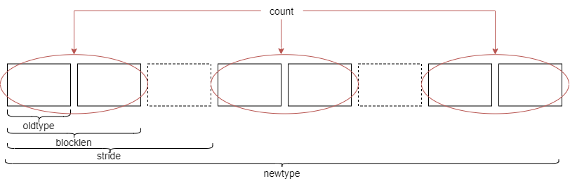
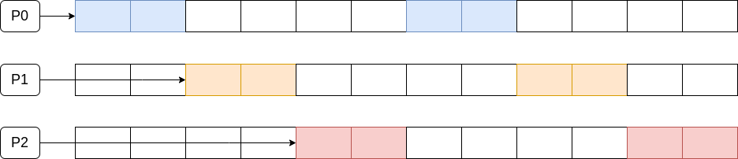
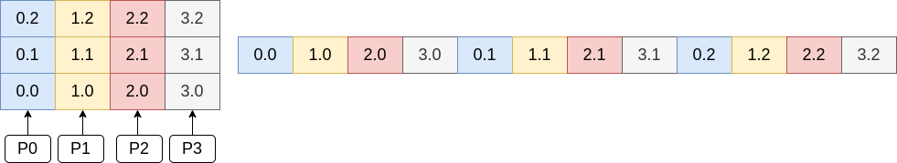

# **Compilazione da linea di comando con OPENMP**

## Compilazione del file .c

Il file punto c viene compilato con la direttiva :

``` console
		consoleU@:~$ gcc -c nomefile.c -o nomefile.o -fopenmp
		
		consoleU@:~$ gcc -o nomefile nomefile.o -fopenmp (librerie di seguito)
		
		consoleU@:~$ (time) ./nomefile
```

# **Direttive OMP**

Il pragma supporta diverse tipologie di costrutti che permettono una esecuzione parallela diversa sui thread a
disposizione.

1. ## ***PRAGMA PARALLEL***:

   la direttiva permette di poter parallelizzare l'esecuzione dell' intero blocco funzionale successivo sui thread messi
   a disposizione all'esecuzione del programma

```c
		#pragma omp parallel [clause[[, ]clause] · · · ] 
			structured block or graph
```

***

### Clausole della pragma parallel:

- ### **if**(espressione o uno scalare);

  	permette di condizioneare l'esecuzione del pragma

- ### **num_threads**(intero o espressione);

  	sovrascrive OMP_NUM_THREADS

- ### **shared**(lista delle variabili);

  	specifica quali sono le variabili condivise tra i thread

- ### **private**(lista delle variabili);

  	specifica quali variabili sono private e accessibili unicamente al thread che le utilizza

- ### **default**(none|shared|empty);

  	specifica una politica di gestione per le variabili non specificate nelle clausole private e shared. Il valore empty imposta di default private, il valore shared imposta la politica di shared variables e none blocca l'esecuzione nel caso in cui per almeno una variabile non sia stata specificata la politica di accesso.

### ***Esempio***

Ogni thread messo a disposizione per la parallelizzazione del programma esegue il blocco funzionale sottostante, in
questo caso il ciclo for.

Otterremo un output dato da **OMP_NUM_THREADS** esecuzioni concorrenti del for.

```c
	#pragma omp parallel shared(n) private (i)
	{
		#pragma omp for
			for (i = 0; i<n; ++i)
				printf("Thread %d, executes iteration %d\n",omp_get_thread_num(), i);
	}
```

2. ## ***PRAGMA FOR***:

   Il pragma for permette di poter suddividere l'esecuzione di un singolo for sull'insieme di thread a disposizione. Ciò
   permette di eseguire una sola volta il for, ma aumentare le prestzioni tramite la parallelizzazione.

```c
		#pragma omp parallel for[clause[[, ]clause] · · · ] 
			structured block or graph
```

***

### Clausole del pragma for

- ### **private**(lista delle variabili);

  	specifica quali variabili sono private e accessibili unicamente al thread che le utilizza
- ### **firstprivate**(lista delle variabili);

  	specifica che la variabile, esistente già prima della sezione parallela, abbia modalità di accesso privata e che il suo valore sia inizializzato allo stesso valore ad essa precedentemente assegnato

- ### **last private** (lista delle variabili);
  	specifica che al termine della sezione parallela, la variabile esterna corrispondente assume il valore che la corrispondente variabile interna assume all'ultima iterazione del for o all'ultima sezione del pragma
- ### **ordered**;
  	specifica che il blocco deve essere eseguito in ordine, indipendentemente dall'esecuzione dei thread.
- ### **nowait**
  	fa sì che l'esecuzione della sezione parallela corrente, che di default avviene in seguito al termine della sezione parallela precedentee, avvenga immediatamente, senza aspettare la BARRIERA
- ### **reduction**(operator: lista di variabili);
  	specifica che una o più variabili, che sono private per ogni thread, sono soggetta a una operazione di riduazione alla fine della regione parallela.
  	L'operazione di riduzione consiste nell'applicazione di un operatore aritmetico-logico sull'insieme dei valori assunti da quella variabile nelle varie esecuzioni parallele

  	+ : (v); 
  		∗ : (v); 
  	− : (v); 
  	& : (∼ v); 
  	| : (v); 
  	ˆ: (v); 
  	&& : (v); 
  	|| : (v);

- ### **schedule**(kind [, chunk_size] )
  	la clausola controlla la modalità di divisione tra i thread della computazione da eseguire per quel blocco funzionale
   ***
  ### **Definizione di chunck size**

  La **chunck size** rappresenta la granularità del carico di lavoro assegnato ad un thread nella threadpool. Deve
  essere necessariamente un **intero positivo** e costante all'interno dell'esecuzione.

  Esistono 4 modalità di esecuzione della schedule (kind):

    - **static**:

      	le  iterazioni sono  divise in blocchi (chunck) e assegnate staticamente ai thread in ROUND ROBIN. Se la grandezza dei chunk non è specificata, allora lo spazio delle iterazioni viene diviso equamente.
    - **dynamic**:

      	le  iterazioni sono  assegnate ai thread in maniera dinamica alla richiesta del thread, immediatamente dopo il termine dell'operazione precedente.
      	Se la dimensione del chunck non è specificata, di default è 1.

    - **guided**:

      	analogamente al caso dinamico, ma se il chunck è di grandezza 1, la grandezza del chunck è proporzionale al numero di iterazioni assegnate diviso il numero di thread. Se chunck size è k allora la assegnazione è come precedentemente descritto, ma deve contenere almeno k iterazioni.

    - **runtime**:

      	le  decisioni di divisione sono prese a runtime. Si può specificare TIPO DI SCHEDULE e DIMENSIONE DEL CHUNCK attraverso la variabile di ambiente OMP_SCHEDULE.

### ***Esempio***

Ogni iterazione del ciclo for verrà assegnata a uno dei thread messi a disposizione per l'esecuzione.

Otterremo un output dato da un'unica esecuzione del ciclo for, ma parallelizzata tra **OMP_NUM_THREADS** thread diversi.

```c
	#pragma omp parallel for shared(n) private (i)
		for (i = 0; i<n; ++i)
			printf("Thread %d, executes iteration %d\n",omp_get_thread_num(), i);
	
```

3. ## ***PRAGMA SECTIONS***:

   Il pragma sections permette la divisione della sezione da parallelizzare in sottosezioni ognuna delle quali viene
   eseguita da un thread differente. Nel caso in cui i thread disponibili sono maggiori rispetto alle sezioni da
   assegnare, allora i restanti sono in idle.

```c
		#pragma omp sections [clause[[, ]clause] · · · ] 
		{
			#pragma section {
				structured block or graph
			}
			#pragma section {
				structured block or graph
			}
		}
```

***

### Clausole del pragma sections

- ### **private**(lista delle variabili);
- ### **fistrprivate**(lista delle variabili);
- ### **lastprivate**(lista delle variabili);
- ### **nowait**;
- ### **reduction**(operator: lista di variabili);

### ***Esempio***

Ogni iterazione del ciclo for verrà assegnata a uno dei thread messi a disposizione per l'esecuzione. La nowait, inoltre
ci permette di non rispettare le bariere invertendo, eventualmente, l'ordine dei thread.

Otterremo un output dato da un'unica esecuzione del ciclo for, ma parallelizzata tra **OMP_NUM_THREADS** thread diversi.

```c
	#pragma omp parallel
		{

			#pragma omp sections nowait
			{
			
				#pragma omp section 
					for (int i=0;i<n;++i)
						printf("I'm always the thread  number %d, at iteration n",omp_get_thread_num(),i);
				
				#pragma omp section 
					for (int i=0;i<n;++i)
						printf("I'm always the thread  number %d, at iteration %d\n",omp_get_thread_num(),i);
				
			}

		}
```

4. ## ***PRAGMA SINGLE***:

   Il pragma single specifica che il blocco di istruzioni ad esso associato viene eseguito una sola volta da un thread
   della threadpool, non necessariamente il principale.

   L'esecuzione del blocco nel pragma single forza gli altri thread all'attesa della sua esecuzione. Nel caso in cui
   il **nowait** sia specificato, invece, l'esecuzione di questi ultimi può avvenire.

```c
		#pragma omp single [clause[[, ]clause] · · · ] 
			structured block
```

***

### Clausole del pragma single

- ### **private**(lista delle variabili);
- ### **fistrprivate**(lista delle variabili);
- ### **nowait**;

### ***Esempio***

All'interno del blocco parallelizzato la pragma single permette **l'esecuzione del blocco funzionale** associato una
sola volta, forzando gli altri thread all'idle.

```c
	#pragma omp parallel
		{

			#pragma omp parallel shared(a,b) private (i)
				{
					#pragma omp single
					{
						a=42; 
						printf("Single here by %d\n",omp_get_thread_num());
					}
					
					#pragma omp for
						for (i=0;i<n;++i) 
							b[i]=a;
					}
					printf("After parallel : \n");
					for (i=0;i<n;++i)
						printf("b[%d]=%d\n",i,b[i]);
				
				}

			}
```

5. ## ***ALTRI COSTRUTTI DEL PRAGMA***:

- ## **Barrier**;
  ```c
    #pragma omp barrier
```
  Definisce una barriera esplicita.

***

- ## **Ordered**;
  	```c
  	#pragma omp ordered structured − block
  ```
  Appare sempre all'interno di un **pragma (parallel) for** e impone che il blocco di istruzioni successivo avvenga secondo l'ordine del for.

***

- ## **Critical**;
  	```c
  	#pragma omp critical [(name)] structured − block
  ```
  Critical permette di specificare che il successivo blocco di istruzioni deve essere eseguito da un **unico thread per volta**. Solitamente viene utilizzato per implementare un meccanismo di mutua esclusione sulle risorse.

***

- ## **Atomic**;

  ```c
      #pragma omp atomic structured − block
  ```
  Il costrutto atomic assicura che una locazione di memoria specifica venga acceduta atomicamente, cioè **impedisce la
  lettura o la scrittura simultanea** da parte di più thread, evitando valori indeterminati.

<br><br>

# **Esecuzione parallela con message passing MPI**

Il middelware MPI viene impiegato in casi in cui si vuole implementare una comunicazione tra più unità di calcolo
basandosi su una architettura a memoria distribuita.

Le architetture di questo tipo possono avere diverse topologie, date dalla **distribuzione dei nodi** al loro interno.
Nonostante la memoria sia distribuita tra i nodi, attraveerso il meccanismo di message passing, viene fornita
l'astrazione di una memoria centralizzata. Inoltre, il concetto di nodo prescinde dalla sua natura architetturale in
quanto MPI fa' da middelware di supporto alla astrazione del nodo.

## Message passing

Il meccanismo alla base di MPI e del concetto di memoria distribuità è la comunicazione implementata mediante **message
passing**. I dati nelle memorie locali di ogni nodo vegnono condivisi mediante un meccanismo di comunicazione basasto
sullo scambio di messaggi.

Le metodologie di scambio di messaggi possono essere di diverso genere:

- comunicazioni **sincrone**, mediante le quali si implementa una comunicazione peer-to-peer di tipo **bloccante**.
- comunicazioni **asincrone**, ediante le quali si possono implementare comunicazioni di tipo **non bloccante**.
- comunicazioni **non peer-to-peer**, definite come comunicazioni collettive nelle quali prendono parte tutti i nodi
  della rete.

## Il framework MPI

Il framework MPI è un middelware costituito da più librerie in grado di implementare l'esecuzione parallela su
architetture a memoria distribuita.

MPI lavora creando dei processi all'interno dei vari nodi sui quali vengono distribuite le istruzioni. La configurazione
ottima si ha quando vengono creati tanti processi quanti sono i core a disposizione nella rete.


MPI crea un insieme di processi che sono racchiusi nell'insieme **MPI_COMM_WORLD**. AL suo interno sono suddivisi in **
gruppi**. E'importante notare che i processi di un singolo gruppo non devono necessariamente appartenere allo stesso
nodo, prescindendo dalla architettura sottostante.

Si definiscono due concetti fondamentali per MPI:

- **gruppo**: ovvero un insieme logico di processi. Se un gruppo è costituito da p processi, allora verrà assegnato
  un **rank** a ogni processo, partendo da 0 a p-1.
- **communicator**: Una struttura che permette a un insieme di processi di comunicare tra loro. In ogni communicator
  deve essere assegnato un rank a ogni processo che va da 0 a p, dove p è il numero di processi. **MPI_COMM_WORLD** è il
  communicator di default per tutti i processi. La **size** del communicato è data dal numero dei suoi processi e non
  può essere cambiata dopo la sua creazione.

# Compilare un programma MPI

Mediante MPICH è possibile compilare e linkare automaticamente un file .c con le librerie di MPI.

``` console
		consoleU@:~$ mpicc nomefile.c -o nomefile
		
		consoleU@:~$ mpirun -np numero_processi_da_istanziare ./nomefile
		
```

Attraverso **numero_processi_da_istanziare** posso specificare quanti processi MPI deve creare per l'esecuzione
parallela del programma.

<br>

### *Esempio*

```c
	#include <mpi.h>
	#include <stdio.h>
	#include <stdlib.h>

	int main (int argc, char * argv[]){

		int rank, size;
		MPI_Init(&argc, &argv); //init MPI environment
		//get rank and size of communicator
		MPI_Comm_rank(MPI_COMM_WORLD, &rank);
		MPI_Comm_size(MPI_COMM_WORLD, &size);

		printf("Hello! I am rank # %d of %d processes\n", rank,size);

		MPI_Finalize(); //Terminate MPI execution env.
		exit(EXIT_SUCCESS);

	}
```

- **MPI_INIT**: inizializza l'environement MPI prendedo gli argomenti a linea di comendo e legge il numero di processi
  da inizializzare;
- **MPI_COMM_RANK**: prende il rank del processo che sta eseguendo l'istruzione, leggendono da MPI_COMM_WORLD, e lo
  assegna alla variabile rank.
- **MPI_COMM_SIZE**: legge da MPI_COMM_WORLD il numero dei processi istanziati e assegna il valore alla variabile size.
- **MPI_FINALIZE**: termina l'esecuzione dell'environement MPI.

<br>

# **Comunicazioni MPI: <i>sincrona bloccante**</i>

Comunicazione peer-to-peer dove sono definiti un mittente e un ricevente.<br>
Il peer ricevente aspetta la **ricezione completa** del messaggioda parte del peer mittente. Il mittente, in seguito
all'invio del messaggio, si mette in ascolto dell' **ACK di conferma** da parte del ricevente.

***

## **Blocking send**

```c
	int MPI_Send(void *buf, int count, MPI_Datatype datatype,int dest, int tag, MPI_Comm comm)
```

**Parametri**:

- ***buf**: puntatore a **un'area di memoria** dove risiedono i dati da inviare;
- **count**: **numero di elementi** che sono memorizzati nell'area puntata da buf. Esso è un intero non negativo;
- **datatype**: tipologia di dati memorizzati scelti tra gli MPI DATA TYPES.
    - **MPI_CHAR**;
    - **MPI_INT**;
    - **MPI_FLOAT**;
    - **MPI_DOUBLE**;
    - **MPI_LONG**;
    - in aggiunta ci sono anche **strutture** di MPI_DATA_TYPES, **array** indicizzati e **datatypes personalizzati**.
- **dest**: il **rank** del processo destinatario.
- **tag**: un tag che è indicato per identificare il tipo di comunicazione, quindi definire dei **sottocanali** di
  comunicazione.
- **comm**: specifica il **COMMUNICATOR** doe il processo sta inviando i dati;

<br>

#### **Differenza tra MPI_Send e MPI_SSend**

La prima termina la sua esecuzione nel momento in cui il buffer di invio è vuoto e quindi riusabile, **senza attendere
la corretta ricezione dei dati** da parte del processo ricevente.
<br>
La seconda, definita come SECURE SEND, **attende sempre che il ricevente abbia terminato la ricezione dei dati** prima
di terminare la propria esecuzione, nonstante il buffer sia vuoto.

***

## **Blocking recieve**

```c
	int MPI_Recv(void *buf, int count, MPI_Datatype datatype,int source, int tag, MPI_Comm comm, MPI_Status *status)
```

**Parametri**:<br>
I parametri sono analoghi al caso precedente fatta eccezione per:
<br>

- **source**: il quale indica il **rank del processo mittente**;
- **MPI_STATUS**: contenente **informazioni sullo stato del messaggio ricevuto**.

<br>

### *Esempio*

```c
	#include <stdio.h>
	#include <mpi.h>

	int main(int argc, char** argv) {
		
		int rank, n_ranks;
		int numbers = 5;
		int send_message[numbers];
		int recv_message[numbers];
		MPI_Status status;

		// First call MPI_Init
		MPI_Init(&argc, &argv);

		// Get my rank and the number of ranks
		MPI_Comm_rank(MPI_COMM_WORLD, &rank);
		MPI_Comm_size(MPI_COMM_WORLD, &n_ranks);

		// Generate numbers to send
		int sign=-1;
		if (rank == 0) 
			sign = 1; 

		for( int i=0; i<numbers; i++){
			send_message[i] = sign * (i+1);
		}
		
		if( rank == 0 ){
			// Rank 0 will send first
			MPI_Send(send_message, numbers, MPI_INT, 1, 0, MPI_COMM_WORLD);
		}

		if( rank == 1 ){
			// Rank 1 will receive it's message before sending
			MPI_Recv(recv_message, numbers, MPI_INT, 0, 0, MPI_COMM_WORLD, &status);
			printf("Message received by rank %d \n", rank);
			for (int i = 0; i<numbers; i++)
				printf("%d--%d ",rank,recv_message[i]);
			printf("\n");
		}

		if( rank == 1 ){
			// Now rank 1 is free to send
			MPI_Send(send_message, numbers, MPI_INT, 0, 0, MPI_COMM_WORLD);
		}

		if( rank == 0 ){
			// And rank 0 will receive the message
			MPI_Recv(recv_message, numbers, MPI_INT, 1, 0, MPI_COMM_WORLD, &status);
			printf("Message received by rank %d \n", rank);
			for (int i = 0; i<numbers; i++)
			printf("%d--%d ",rank,recv_message[i]);
			printf("\n");
			
		}

		// Call finalize at the end
		return MPI_Finalize();

	}

```

E' necessario implementare una logica di tipo **sender-recieve alternata** in quanto, nel caso in cui volessimo
implementare la comunicazione reciprova contemporanea, si incorrerebbe in un errore causato da una **deadlock**.

***

## **SendRecieve call**

```c
	int MPI_Sendrecv(void* sendbuf, int sendcount, MPI_Datatype senddatatype, int dest, int endtag, void* recvbuf, int recvcount, MPI_Datatype recvdatatye, int src, int recvtag,MPI_Comm comm, MPI_Status * status);
```

**Parametri**:<br>

- **sendbuf**: specifica il **buffer del processo mittente**;
- **sendcount**: specifica il **numero degli elementi del send buffer**;
- **senddatatype**: specifica il **tipo di dato** inviato dal mittente (mpi_data_types precedenti);
- **dst**: specifica il **rank del processo ricevente**;
- **sendtag**: tag del messaggio inviato;
- **recvbuffer**: specifica il **buffer del processo ricevente**;
- **recvcount**:  specifica il **numero di elementi nel recv buffer**;
- **recvdatatype**: specifica il **tipo di dato** ricevuto (mpi_data_types precedenti);
- **src**: specifica il **rank del processo mittente**;
- **recvtag**: tag del messaggio ricevuto;
- **comm**: specifica il **COMMUNICATOR** in cui sta avvenendo la comunicazione;
- **status**: struttura dati contenente **informazioni sullo stato del messaggio ricevuto**.

<br>

### *Esempio*

```c
	#include <stdio.h>
	#include <stdlib.h>
	#include <mpi.h>

	#define numbers 3

	int main(){
		int rank,size;
		MPI_Init(NULL,NULL);
		MPI_Comm_size(MPI_COMM_WORLD,&size);
		MPI_Comm_rank(MPI_COMM_WORLD,&rank);
		MPI_Status status;

		int *sendbuf,*recvbuf;
		if ( NULL == (sendbuf = malloc( 10 * sizeof (int) ))) exit(1);       
		if ( NULL == (recvbuf = malloc( 10 * sizeof (int) ))) exit(1);       
	
		for ( int i = 0 ; i < numbers; i++) {
			sendbuf[i] = rank;
			recvbuf[i] = -100;
		}

		int next_rank, prev_rank;
		next_rank = (rank < size -1) ? rank + 1 : MPI_PROC_NULL;   
		prev_rank = (rank >    0   ) ? rank - 1 : MPI_PROC_NULL;   

		for ( int i = 0 ; i < numbers; i++)
			printf("[Before] Send Rank: %d\tRecv Rank: %d\n",sendbuf[i],recvbuf[i]);
	  
		MPI_Sendrecv( sendbuf, numbers, MPI_INT, next_rank, 0, recvbuf, numbers, MPI_INT, prev_rank, MPI_ANY_TAG, MPI_COMM_WORLD, &status );

		for ( int i = 0 ; i < numbers; i++)
			printf("[After] Send Rank: %d\tRecv Rank: %d\n",sendbuf[i],recvbuf[i]);

	
		free(sendbuf);
		free(recvbuf);

		MPI_Finalize();
		return 0;
	}

```

<br><br>

# **Comunicazioni MPI: <i>asincrona non bloccante</i>**

Comunicazione peer-to-peer dove sono definiti un mittente e un ricevente.<br>
Il peer mittente inserisce il messaggio in una **coda di invio** (buffer). Il messaggio viene trasferito dal buffer del
peer mittente a quello del ricevente mediante il **middelware MPI**.<br>
Il peer ricevente **all'occorrenza legge il messaggio**  e analogamente risponde attraverso l'inserimento del messaggio
nel proprio **buffer di risposta**.

***

## **Non blocking *send***

```c
	int MPI_Isend(void* data, int count, MPI_Datatype datatype, int destination, int tag, MPI_Comm communicator, MPI_Request* request)
```

**Parametri**:<br>

- **data**: specifica quale è l'area di memoria dove sono presenti i dati da inviare;
- **count**: specifica il numero di elementi da inviare;
- **datatype**: specifica il tipo di dato da inviare;
- **destination**: specifica il rank del processo destinaario;
- **tag**: tag del messaggio;
- **communicator**: il communicator utilizzato;
- **request**: gestore di richiesta non bloccante (usata per wait e test), viene usata per sapere quando la gestione di
  una operazione non bloccante è completa;

***

## **Non blocking *recieve***

```c
	int MPI_Irecv(void* data,int count, MPI_Datatype datatype, int src, int tag, MPI_Comm communicator, MPI_Request* request);

```

**Parametri**:<br>

- **data**: specifica quale è l'area di memoria del buffer di ricezione;
- **count**: specifica il numero di elementi nel buffer di ricezione;
- **datatype**: specifica il tipo di dato da ricevere;
- **src**: specifica il rank del processo mittente;
- **tag**: tag del messaggio;
- **communicator**: il communicator utilizzato;
- **request**: gestore di richiesta non bloccante (usata per wait e test), viene usata per sapere quando la gestione di
  una operazione non bloccante è completa;

<br>

***

## **Wait**

La funzione di wait permette di implementare la sincronizzazione tra i processi che comunicano in modo asicrono. In
particolare viene utilizzata in combinazione con la recieve per **implementare l'attesa del termine del trasferimento
dei dati al ricevente**.

Il parametro **request** è il medesimo inizializzato nella recieve di riferimento.

```c
	int MPI_Wait(MPI_Request* request, MPI_Status* status)

```

**Parametri**:<br>

- **request**: specifica quale è l'operazione send o recieve da dover sincronizzare;
- **status**: struttura che contiene l'esito della request attesa;

<br>

### *Esempio*

```c
	#include <stdio.h>
	#include <stdlib.h>
	#include <mpi.h>

	int main(int argc, char** argv) {
		int rank, n_ranks, neighbour;
		int n_numbers = 5;
		int *send_message;
		int *recv_message;
		MPI_Status status;
		MPI_Request request;
		int return_value;

		send_message = malloc(n_numbers*sizeof(int));
		recv_message = malloc(n_numbers*sizeof(int));

		// First call MPI_Init
		MPI_Init(&argc, &argv);

		// Get my rank and the number of ranks
		MPI_Comm_rank(MPI_COMM_WORLD, &rank);
		MPI_Comm_size(MPI_COMM_WORLD, &n_ranks);

		// Call the other rank the neighbour
		if( rank == 0 ){
			neighbour = 1;      
		} else {
			neighbour = 0;
		}

		// Generate numbers to send
		for( int i=0; i<n_numbers; i++){
			send_message[i] = i + (rank*10);
		}

		// Send the message to other rank
		MPI_Isend(send_message, n_numbers, MPI_INT, neighbour, 0, MPI_COMM_WORLD, &request);

		// Receive the message from the other rank
		MPI_Irecv(recv_message, n_numbers, MPI_INT, neighbour, 0, MPI_COMM_WORLD, &request);
		MPI_Wait( &request, &status );
		printf("Message received by rank %d \n", rank);

		// Call finalize before freeing messages
		return_value = MPI_Finalize();

		free(send_message);
		free(recv_message);
		return return_value;
	}

```

<br><br>

# **Operazioni collettive**

Sono presenti nell'ambito delle operazioni di messaggistica, delle operazioni collettive, dette così in quanto
interagiscono su più nodi contmporaneamente e il cui funzionamento è basato sulle primitive precedentemente descritte.

***

- ## **Sincronizzazione: Barrier**

  La MPI_Barrier è un tipo di operazione che interessa tutti i processi allocati. Ogni processo che entra nella barriera
  viene bloccato e aspetta che **tutti siano sincronizzati alla barriera**, ma essi devono appartenere ad uno stesso
  comunicatore.
  <br>
  Tutti i processi **escono dalla barriera contemporaneamente**.
  ```c
  int MPI_barrier(MPI_Comm communicator)

  ```

***

- ## **One to all communication: Broadcast**
  L'operazione di broadcast permette l'invio **da un nodo a tutti i nodi** eccetto se stesso dell'informazione.

  ```c
      int MPI_Bcast (void * data, int count, MPI_Datatype datatype,int root, MPI_Comm communicator)

  ```
  **Parametri:**

    - **data**: indirizzo iniziale del **buffer di invio**;
    - **count**: **numero di elementi** nel buffer;
    - **datatype**: **tipo di dato** del buffer (riferirsi agli MPI data type precedenti);
    - **communicator**:specifica il **comunicatore** di appartenenza;
    - **root**: **rank identificativo** del processo che invia il messaggio;

  I ricevitori adoperano per la ricezione o una **recieve** o una **all-to-one** operation per la ricezione.

  

  ***

- ## **One to all communication: Scatter**
  L'operazione di sscatter permette di **dividere** il messaggio da inoltrare in **chuncks**, **consegnandoli ai
  processi del communicator** in cui è definito.
  <br>

  Ogni chunck è grande al massimo **sendcount / nrank = recvcount.**
  L'ultimo chunk potrà essere di taglia inferiore a quella calcolata in precedenza.
  ```c
      int MPI_Scatter( void* sendbuf, int sendcount, MPI_Datatype sendtype, void* recvbuffer, int recvcount, MPI_Datatype recvtype, int root, MPI_Comm communicator)

  ```
  **Parametri:**
    - **sendbuf**: indirizzo di memoria iniziale del **buffer di invio** ed è significativo unicamente per la radice;
    - **sendcount**: **numero di elementi** inviati in totale ad ogni processo;
    - **sendtype**: **tipo di dato** del buffer di invio (riferirsi agli MPI data type precedenti);
    - **recvbuffer**: indirizzo di memoria iniziale del **buffer di ricezione** ed è un parametro di output;
    - **recvcount**: **numero di elementi ricevuti nel recvbuffer**;
    - **recvtype**: **tipo di dato** del buffer di ricezione (riferirsi agli MPI data type precedenti);
    - **communicator**:specifica il **comunicatore** di appartenenza;
    - **root**: **rank identificativo** del processo che invia il messaggio;

  

  ***
- ## **All to one communication: Gather**
  L' operazione di **gather** **raccoglie i valori da un gruppo di processi**, andando a ricostruire il messaggio nel
  nodo radice.
  <br>

	```c
		int MPI_Gather( void* sendbuf, int sendcount, MPI_Datatype sendtype, void* recvbuffer, int recvcount, MPI_Datatype recvtype, int root, MPI_Comm communicator)

	```
	**Parametri:**
	- **sendbuf**: indirizzo di memoria iniziale del **buffer di invio**;
	- **sendcount**: **numero di elementi** nel buffer di invio;
	- **sendtype**: **tipo di dato** del buffer di invio (riferirsi agli MPI data type precedenti);
	- **recvbuffer**: indirizzo di memoria del **buffer di ricezione** ed è un parametro di output significativo per il ricevitore;
	- **recvcount**: **numero di elementi ricevuti** ad ogni singola ricezione, significativo solo per il nodo radice;
	- **recvtype**: **tipo di dato** del buffer di ricezione (riferirsi agli MPI data type precedenti);
	- **communicator**:specifica il **comunicatore** di appartenenza;
	- **root**: **rank identificativo** del processo che riceve tutti i messaggi;

	

	***

- ## **All to one communication: Reduce**
  L' operazione di **reduce**, come nella gather, **raccoglie i valori da un gruppo di processi**, andando a ricostruire
  il messaggio nel nodo radice, ma alla funzione di raccolta si associano delle **operazioni sui dati**.
  <br>
  La radice sarà **il contenitore del dato finale**.
  <br>
  Le operazioni di riduzione **vengono effettuate secondo uno schema ad albero**.

  ```c
      int MPI_Reduce( void* sendbuf, void* recvbuffer, int count, MPI_Datatype datatype, MPI_Op op, int root, MPI_Comm communicator)

  ```
  **Parametri:**
    - **sendbuf**: indirizzo di memoria iniziale del **buffer di invio**;
    - **count**: **numero di elementi** nel buffer di invio;
    - **recvbuf**: indirizzo di memoria del **buffer di ricezione**. E' un parametro di output, significativo soltanto
      per la radice;
    - **datatype**: **tipo di dato** del buffer di invio (riferirsi agli MPI data type precedenti);
    - **op**: operazioni di riduzione possibili. Esse consistono di:
        - **MPI_SUM**: somma gli elementi e ne inserisce la somma nel processo ricevente;
        - **MPI_PROD**: effettua il prodotto tra i valori dei vari processi;
        - **MPI_MAXLOC**:calcola il valore massimo tra i processi e il rank del processo che detiene il dato;
        - **MPI_MINLOC**: calcola il valore minimo tra i processi e il rank del processo che detiene il dato;
        - **MPI_MAX**: ottiene il valore massimo tra i processi;
        - **MPI_MIN**: ottiene il valore minimo tra i processi;
    - **communicator**:specifica il **comunicatore** di appartenenza;
    - **root**: **rank identificativo** del processo che riceve tutti i messaggi;

  <br>

  

  ***

- ## **All to one communication: Allreduce**
  L'operazione di allreduce combina i valori ottenuti dai vari processi. Successivamente, partendo dal processo radice,
  il dato **calcolato viene ridistribuito** a tutti i processi.

  <br> Viene visto come una combinazione di una operazione di **reduce e broadcast**.

  ```c
      int MPI_Allreduce( void* sendbuf, void* recvbuffer, int count, MPI_Datatype datatype, MPI_Op op, MPI_Comm communicator)

  ```
  **Parametri:**
    - **sendbuf**: indirizzo di memoria iniziale del **buffer di invio**;
    - **count**: **numero di elementi** nel buffer di invio;
    - **recvbuf**: indirizzo di memoria del **buffer di ricezione**. E' un parametro di output, significativo soltanto
      per la radice;
    - **op**: tipo di operazione da effettuare (guarda listato reduce);
    - **datatype**: **tipo di dato** del buffer di invio (riferirsi agli MPI data type precedenti);
    - **communicator**: specifica il **comunicatore** di appartenenza;

  <br>

  
  <br><br><br>

# **Datatypes derivati**

Sono dei tipi di dato definiti dall'utente e basati sui datatype di MPI. Questi sono utili nel caso in cui si debba
lavorare con dei dati non contigui o misti all'inetrno di processi diversi in modo parallelo.

## **Costruzione di un datatype**

I datatype vengono costruiti a partire da un template denominato **MPI_Datatype**. Per poter utilizzare il dato devo:

- **dichiarare** il tipo di dato specificando un identificativo;
- **allocare** il dato in memoria con **MPI_Type_commit()**;
- **impiegare** il dato;
- **deallocare** il dato , quando non più impiegato, con **MPI_Type_free()**;

### *Esempio*

```c
	MPI_Datatype new_type; //datatype name declaration
	...
	MPI_Type_XXX(..., &new_type); //construct the datatype
	MPI_Type_commit (&new_type); //Allocate
	// ... Some work here
	...
	MPI_Type_free(&new_type); //remove

```

***
<br>

## **Costruttori di datatypes**

Sono presenti diversi tipi di costruttori i quali si differenziano per la tipologia di dato allocato in memoria.

<br> 

- ### **MPI_Type_contiguous**
  Permette di creare un datatype di tipo contiguo (array-like) di elementi di tipo oldtype.

  ```c
      int MPI_Type_contiguous(int count, MPI_Datatype oldtype, MPI_Datatype * newtype)
  ```

  **Parametri:**
    - **count**: numero di **solt da allocare** di tipo oldtype;
    - **oldtype**: **tipo elementare** che forma un' unità della struttura;
    - **newtype**: puntatore alla **struttura dati** formata grazie alla direttiva contiguous;
      <br>
      <br>
      
      <br>
  ***
- ### **MPI_Type_vector**
  Permette di creare un datatype formato da **count vettori contigui** di tipo oldtype e di **lunghezza blocklen** **
  spaziati di stride-blocklen** elementi.

  ```c
      int MPI_Type_vector(int count, int blocklen, int stride, MPI_Datatype oldtype, MPI_Datatype *newtype)
  ```

  **Parametri:**
    - **count**: numero di **blocchi da allocare** ;
    - **blocklength**: **numero di elementi** in ogni blocco;
    - **stride**: numero di **elementi che intercorrono tra i blocchi iniziali** di ogni blocco;
    - **oldtype**: **tipo elementare** che forma un' unità della struttura;
    - **newtype**: puntatore alla **struttura dati** formata grazie alla direttiva;
      <br>
      <br>
      

  <br>

  ***

- ### **MPI_Type_hvector**
  Permette di creare un datatype formato da **count vettori contigui** di tipo oldtype e di **lunghezza blocklen**, le
  cui posizioni iniziali sono shiftate di un numero di bytes pari a **stride**.

  ```c
      int MPI_Type_hvector(int count, int blocklength, MPI_Aint stride, MPI_Datatype oldtype, MPI_Datatype * newtype)
  ```

  **Parametri:**
    - **count**: numero di **blocchi da allocare** ;
    - **blocklength**: **numero di elementi** in ogni blocco;
    - **stride**: **bytes che intercorrono tra l'inizio** di ogni blocco;
    - **oldtype**: **tipo elementare** che forma un' unità della struttura;
    - **newtype**: puntatore alla **struttura dati** formata grazie alla direttiva;
      <br>

  ***
- ### **MPI_Type_create_struct**
  Permette di **creare** un tipo di dato MPI_datatype **da un insieme**, anche disomogeneo, **di MPI_datatype, lunghezze
  di blocchi e intervalli tra gli inizi** dei vari blocchi.

  ```c
      int MPI_Type_create_struct(int nblocks, const int array_of_blocklen[], const MPI_Aint array_of_displacements[], const MPI_Datatype array_of_types[], MPI_Datatype *newtype)
  ```
  **Parametri:**
    - **nblocks**: numero di blocchi, può anche rappresentare il numero di elementi nelle strutture **array_of_blocklen,
      array_of_types, array_of_displacements**;
    - **array_of_blocklen**: **numero di elementi** in ogni blocco;
    - **array_of_displacements**: array che rappresenta i **bytes che intercorrono tra l'inizio** di ogni blocco;
    - **array_of_types**: array di **tipi elementari** che formano ogni blocco;
    - **newtype**: puntatore alla **struttura dati** formata grazie alla direttiva;
      <br>
      <br>
  ### *Esempio*

  ```c
      n_blocks = 3
      array_of_blocklen = [2,3,1]
      array_of_displacements = [0, 3*sizeof(MPI_Int), 5*sizeof(MPI_Char)]
      array_of_types = [MPI_Int,MPI_Char,MPI_Double] 
      //corrsipondenti ai blocchi di tipo A,B,C
  ```
  <br>

  

  <br>

  ### *Nota bene:*
    - Il compilatore potrebbe inserire uno o più bytes vuoti per compattare la struttura.
    - Tramite la funzione **MPI_Get_address** si può ottenere l'indirizzo di memoria di una locazione.

  ***
- ### **MPI_Type_create_subarray**
  Permette di creare da un **MPI_datatype** il quale descrive un **subarray m-dimensionale partendo da un array
  m-dimensionale**. Il subarray può essere definito a partire da ogni punti interno all'array e la sua dimensione va
  da **0 alla dimensione massima dell'array iniziale**.

  ```c
      int MPI_Type_create_subarray(int ndims, const int sizes[], const int subsizes[], const int starts[], int order, MPI_Datatype oldtype, MPI_Datatype * newtype)
  ```
  **Parametri:**
    - **ndims**: numero di **dimensioni** dell'array;
    - **sizes**: **numero di elementi** di tipo old type in ogni dimensione dell'**array iniziale**;
    - **subsizes**:** numero di elementi** di tipo old type in ogni dimensione del **sottoarray**;
    - **starts**: **coordinate iniziali** del sottoarray per ogni dimensione;
    - **order**: **flag** dell'ordine di **archiviazione** dell'array (MPI_ORDER_C);
    - **oldtype**: **tipo di dato** dell'array;
    - **newtype**: puntatore alla **struttura dati** formata grazie alla direttiva;
      <br>
      <br>

  ### *Esempio*

  ```c
      starts = [1, 3]
      subsizes = [3, 2]
      sizes = [5, 6]
  ```
  <br>

  

  <br>

  ***

<br>

# **Gestione dell I/O in programmi paralleli**

La gestione dei file in MPI richiede la comprensione di come i file vengono distribuiti attraverso i vari nodi. In
particolare bisogna comprendere come avviene lo scambio di chunk di file tra i vari nodi e come agire nel caso in cui
essi abbiano a disposizione il file localmente.

<br>
Gli approcci adoperati sono sostanzialmente tre:

- **master slave**: nodo detentore dei file dal quale gli altri nodi andranno a leggere;
- **aproccio distribuito**;
- **completamente parallela**;

Questi approcci soono delle astrazioni fornite da MPI che sottintendono una sottostruttura più complessa e che dovranno
essere gestiti in modo opportuno. Pertanto nella valutazione delle prestazioni vanno considerate anche queste operazioni
di maggiore onere computazionale.

- ## **Approccio master-slave**
  Un pool di nodi **slave**, per effettuare una elaborazione dei dati, **deve inviare una richiesta al nodo** **master**
  che detiene tutti i dati. Esso legge il dato e lo fornisce al nodo slave dal quale è stato interrogato. In seguito
  quest'ultimo portà effettuare la sua elaborazione.

  ### Pro:
    - favorisce la **consistenza dei dati** attraverso il suo funzionamento sequenziale
  ### Contro:
    - **non sono parallelizzabili** i vari altri task in quanto la risorsa condivisa risulta essere bloccata durante
      l'elaborazione di un altro rocesso.
    - la **messaggistica** impiegata nel trasferimento di informazioni è molto grande e potrebbe abassare le prestazioni
      del software.

  <br>

  

  <br>

  ***

- ## **Approccio I/O distribuito su file separati**
  In questo approccio ogni nodo possiede una parte del file. Nel caso in cui necessiti di un file memorizzato in un
  altro nodo, esso effettua una opportuna richiesta.

  ### Pro:
    - La soluzione è molto **scalabile** in quanto basata sulla suddivisione dei file;
    - Nel caso di **suddivisione corretta** delle operazioni su file per ogni processo, **non sono presenti
      comunicazioni**. In caso contrario il comportamento è analogo al master slave.
  ### Contro:
    - Non è impiegabile poichè il **file presenta una unica copia** all'interno dei nodi e in caso di down di un nodo
      il **file verrebbe perso**. Inoltre potrebbe anche essere **interrotta la computazione** corrente.

  <br>

  

  <br>

  ***

- ## **Approccio completamente parallelo**
  Si basa sull'approccio distribuito aggiungendo un'astrazione intermedia. I nodi vedono i dati come se essi facciano
  parte di un unico file. Il nodo, pur accedendo su un file comune, lavora sulla propria sezione di file **permettendo
  così la parallelizzazione** della computazione.

  ### Pro:
    - La soluzione è molto **scalabile** in quanto i file accedono ai dati come se accedesero in locale;
    - Con l'astrazione di memoria condivisa si evitano le comunicazioni tra i nodi;
    - Si risolve il problema della perdita di dati in caso di down di un nodo, in quanto per MPI il file è indipendente
      dal nodo che ne usufruisce;
  ### Contro:
    - È richiesto uno sforzo implementativo per permettere la astrazione di file unico.

  <br>

  

***
<br>  

# **Primitive per la gestione dei file**

## **Apertura del file**

L'apertura del file avviene mediante la funzione MPI_File_open. La funzione apre il file indicato dal **filename** su **
tutti i processi del comunicator**. Un file può ssere aperto da un processo in modo indipendente dagli altri
specificando come communicator **MPI_COMM_SELF**.
<br>
Questa apertura supporta unicamente dei file **binari**.

```c
	int MPI_File_open(MPI_Comm comm, char *filename, int amode, MPI_Info info, MPI_File *fh)
```

**Parametri:**

- **comm**: specifica il communicator (MPI_COMM_WORLD);
- **filename**: stringa identificativa del **nome del file**;
- **amode**: intero che rappresenta la modalità di apertura del file, la stessa per tutti i processi;
    - **MPI_MODE_RDONLY**: apertura del file in lettura unicamente;
    - **MORE_MODE_RDWR**: apertura del file in scrittura e lettura;
    - **MPI_MODE_WRONLY**: apertura del file unicamente in scrittura;
    - **MPI_MODE_CREATE**: crea il file se non esiste;
    - **MPI_MODE_EXCL**: genera un errore se il file esiste;
    - **MPI_MODE_DELETE_ON_CLOSE**: elimina il file quando viene chiuso;
    - **MPI_MODE_SEQUENTIAL**: il file pointer non può esser e mosso manualmente;
    - **MPI_MODE_UNIQUE_OPEN**: il file non può essere aperto altrove nel sistema;
    - **MPI_MODE_APPEND**: il file pointer viene spostato alla fine del file all'apertura;

- **info**: oggetto che contiene delle **informazioni dipendenti dal sistema** usato, di default inserire MPI_INFO_NULL
  ;
- **fh**:  valore di ritorno dell'operazione. Rappresenta il **puntatore al file**;
  <br>
  <br>

****
***
<br>

## **Lettura e scrittura su file**

A seconda della metodologia di implementazione della gestione dei file, il file pointer deve assumere un diverso
significato e i dati vengono gestiti in modo coerente alla metodologia impiegata.

<br>

***

- ## **Shared filepointer**
  Ogni processo ha lo stesso file **pointer tra loro condiviso**.<br>
  Ciò può portare a un **calo di prestazioni** dovuto alla mancata parallelizzazione delle **operazioni**, le quali sono
  necessariamente **collettive**.

    - ### **MPI_File_write_ordered**
      **Un'operazione colettiva**, chiamata da **tutti i processi** del comunicatore sul file pointer. Ogni processo
      prova a **scrivere un numero count di dati** nel file.
      <br><br>
      La posizione in cui **scrive è il punto in cui il file pointer punterebbe se tutti i processi con rank inferiore a
      quello corrente avessero scritto i propri dati prima di esso**.

      ```c
          int MPI_File_write_ordered(MPI_File fh, void *buf, int count, MPI_Datatype datatype, MPI_Status * status)
      ```
      **Parametri:**
        - **fh**: specifica il **file pointer**;
        - **buf**: **indirizzo iniziale** del buffer;
        - **count**: **numero di elementi** da scrivere su file;
        - **datatype**: **tipo di dato** da scrivere;
        - **status**: descrittore dello **stato** dell'operazione;

****

<br><br>

- ## **Local filepointer**

  Nell'approccio locale ogni processo **possiede il proprio file pointer locale**, salvato all'interno di una variabile
  locale ad esso. <br>
  Le **operazioni** possono essere **sia collettive che non collettive**, ma utilizzando sempre il file pointer locale
  ad ogni processo.

    - ### **MPI_File_seek**
      Operazione che permette di aggiornare il file pointer attuale in accordo con il parametro whence.
  ****

  ```c
      int MPI_File_seek(MPI_File fh, MPI_Offset offset, int whence)
  ```

  **Parametri:**
    - **fh**: specifica il **file pointer**;
    - **offset**: **offset rispetto** alla posizione **whence**;
    - **whence**:  modalità in cui viene aggiornato il file pointer:
        - **MPI_SEEK_SET**: il pointer è settato **all'offset**;
        - **MPI_SEEK_CUR**: il pointer è settato **alla posizione corrente più l'offset**;
        - **MPI_SEEK_END**: il pointer è settato **alla fine del file più l'offse**t;

  <br>

- ### **MPI_File_write**
  L'operazione prova a scrivere nel file indicato dal file pointer **alla posizione indicata da esso** (ogni processo
  mantiene la propria posizione in quanto il file pointer è locale).

  ```c
      int MPI_File_write(MPI_File fh, void *buf, int count, MPI_Datatype datatype, MPI_Status *status)
  ```
  **Parametri:**
    - **fh**: specifica il **file pointer**;
    - **buff**: **indirizzo iniziale** del buffer;
    - **count**: **numero di elementi** da scrivere su file;
    - **datatype**: **tipo di dato** da scrivere nel file;
    - **status**: **stato** della operazione;

  <br>

- ### **MPI_File_write_all**
  L'operazione ha un funzionamento **analogo alla write** ad eccezione della natura della routine che è **collettiva**.

  ```c
      int MPI_File_write_all(MPI_File fh, void *buf, int count, MPI_Datatype datatype, MPI_Status * status)
  ```
  **Parametri:**
    - **fh**: specifica il **file pointer**;
    - **buff**: **indirizzo iniziale** del buffer;
    - **count**: numero di **elementi da scrivere** su file;
    - **datatype**: tipo di **dato da scrivere** nel file;
    - **status**: **stato** della operazione;

<br>

***

- ## **File views**

Dato un file, una vista permette di definire la **porzione di file visibile ad un processo**.

<br>



<br>

Illustrazione delle viste su tre processi. Ogni processo vede unicamente i blocchi evidenziati dello stesso file. In
questo caso il displacement iniziale è calcolato cone 2*rank del processo.

<br>

Per poter definire una vista ho bisogno di **tre elementi fondamentali**:

- **etype**: tipo di elemento base del file (riferirsi agli MPI_Datatype);
- **displacement**: **spostamento del puntatore all'inizio del file** del primo etype visibile al processo;
- **filetype** : struttura dati o tipo di dato MPI attraverso il quale il **processo deve gestire i blocchi visibili**
  all'interno del file;

	<br>

	***
	
	<br>
	
	- ## **Definizione di una vista**
  	La funzione viene impiegata per **definire una vista su di un file** e associarla al processo che la chiama.
  	```c
  		int MPI_File_set_view(MPI_File fh, MPI_Offset disp, MPI_Datatype etype, MPI_Datatype filetype, const char *datarep, MPI_Info info)
  	```

  	**Parametri:**
  	- **fh**: specifica il **file pointer**;
  	- **disp**: **offset** rispetto all'inizio del **file**;
  	- **etype**: **elemento** **base** del file;
  	- **filetype**: basato sull'etype, può essere uguale o una struttura su di esso basata;
  	- **datarep**: **rappresentazione dei dati**, essendo il file nativamente in byte e avendo l'organizzazione in elementi tipati tramite etype, si può incorrere nel problema del **Marshalling**, ovevro il processo di **trasformazione della memoria in un dato compatibile con memoria e trasmissione su calcolatori diversi**.
  	Sono presenti tre possibili valori:

  		- *Native*: si rispetta lo **standard della architettura** in cui sono salvati i dati. Non ci sono perdite di precisione, in quanto non avvengono delle conversioni, ma il programma non è portabile;
  		- *internal*: per la traduzione viene impiegata la **rappresentazione di MPI**. Portabile per macchine con stessa versione di MPI;
  		- *external32*: si imppiegaper la traduzione uno **standard MPI 32 bit Big-Endian**. 

  	- **info**: **informazioni** riguardanti l'esecuzione della creazione (MPI_INFO_NULL);

	<br>

	***
	
	<br>
	
	- ## **Dati non contigui in una file view**

	Tipi di dato utili nel caso in cui la **rappresentazione dei dati in memoria differisce da quella su file**.****
	<br>
	L'esempio è la rappresentazione su file di una matrice per righe o per colonne.
	<br>
	Questa metodologia potrebbe causare delle **perdite di efficienza**, ma permette di avere una più s**emplice gestione della scrittura dei dati su file**.

	<br>

	

	<br>

	### *Esempio*

	```c
		for (i = 0; i < NELEM; i++) 
			buf[i] = rank + 0.1*i; 
		// Fill buffer

		MPI_Datatype vec_type;
		MPI_Type_vector(NELEM, 1, size, MPI_DOUBLE, &vec_type); 
		MPI_Type_commit(&vec_type);
		// Create vector type
		
		disp = rank*sizeof(double);
		// Compute offset (in bytes)
		MPI_File_set_view(fh, disp, MPI_DOUBLE, vec_type, "native",MPI_INFO_NULL);
		// Set view
		MPI_File_write(fh, buf, NELEM, MPI_DOUBLE, MPI_STATUS_IGNORE);
		// Write
		MPI_Type_free(&vec_type);
	```
	<br>

	***

	<br>

	###  **Decomposizione cartesiana**
	Data la dipendenza della comutazione di un dato dai dati ad esso contigui in alcuni settori, risulta molto utile la decomposizione cartesiana di strutture multidimensionali.
	<br>
	<br>
	In questo caso si vanno a **raggruppare gli elementi per insiemi di dati contigui** e ad essi viene associato un unico processo. 
	<br>
	Si definisce una **corrispondenza quindi tra i processi e le coordinate dei subarray multidimensionali** individuati.
	<br>
	- ### **MPI_Cart_create**
	```c
  		int MPI_Cart_create(MPI_Comm comm_old, int ndims, const int dims[], const int periods[], int reorder, MPI_Comm * comm_cart)
  	```
	**Parametri:**
	- **old**: specifica il vecchio **communicator di appartenenza** dei processi;
	- **ndims**: **dimensioni della griglia cartesiana** (ex: matrice->2);
	- **dims**: **vettore**, di grandezza ndims,che specifica il **numero di processi per ogni dimensione**;
	- **periods**: **vettore booleano**, di grandezza ndims, che specifica se per **ogni dimesione la griglia è periodica**;
	- **reorder**: parametro booleano che specifica se i **processi devono mantenere il rank precedente (false) oppure devono essere riordinati** attenendosi alla topologia virtuale creata dalla decomposizione cartesiana. <br>
	Nel caso in cui il communicator finale abbia **meno processi di quello iniziale**, allora, i processi superflui **verranno ritornati con valore MPI_COMM_NULL**;
	- **comm_cart**: **communicator** ottenuto in seguito alla **decomposizione cartesiana**;


	<br>
	<br>

	 

	<br>

	***
